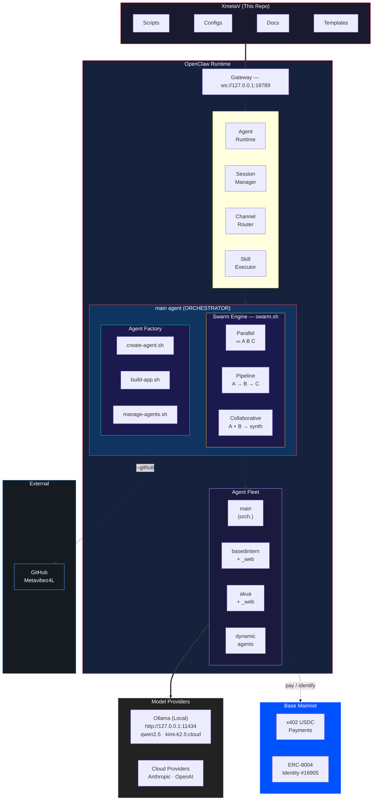

# XmetaV -- OpenClaw Command Center

> **Your central hub for managing OpenClaw agents, gateways, and infrastructure on WSL2/Linux**

Last updated: **2026-02-12** | OpenClaw 2026.2.1 | XmetaV Command Center v11

```
 ___   ___                    __           ___   ___
 \  \ /  / _ __ ___    ___  _/  |_  __ _   \  \ /  /
  \  V  / | '_ ` _ \  / _ \ \   __\/ _` |   \  V  /
  /  X  \ | | | | | ||  __/  |  | | (_| |   /     \
 /__/ \__\|_| |_| |_| \___|  |__|  \__,_|  /__/ \__\

      [ COMMAND CENTER : AGENT ORCHESTRATION ]
  _______________________________________________
 |                                               |
 |   agents:  main | basedintern | akua          |
 |   swarm:   parallel | pipeline | collab       |
 |   payments: x402 USDC micro-payments (Base)   |
 |   identity: ERC-8004 NFT #16905 (Base)        |
 |   token:    $XMETAV ERC-20 (Base)             |
 |   dashboard: Next.js + Supabase (cyberpunk)   |
 |   models:  kimi-k2.5:cloud (256k, all agents) |
 |   gateway: ws://127.0.0.1:18789              |
 |   engine:  Ollama + CUDA  |  RTX 4070        |
 |_______________________________________________|
```

---

## Features

- **Control Plane Dashboard** — Cyberpunk-themed Next.js web UI for agent chat, fleet management, swarm orchestration, and bridge control (Vercel-deployable)
- **Swarm Dashboard** — Create, monitor, and review multi-agent swarm runs from the browser with live streaming output
- **Agent Factory** — main agent can create new agents, scaffold apps, create GitHub repos, and manage the fleet
- **Swarm Orchestration** — parallel, pipeline, and collaborative multi-agent task execution (CLI + dashboard)
- **Fleet Controls** — Enable/disable agents from the dashboard with bridge-side enforcement
- **x402 Payments** — Autonomous USDC micro-payments on Base via `@x402/express` + `@x402/fetch` (pay-per-use API gating for agent services)
- **ERC-8004 Identity** — On-chain agent identity (NFT) and reputation on Base mainnet (Agent #16905)
- **Voice Commands** — Speak to agents via Whisper STT + TTS with x402 payment gating ($0.005-$0.01 per request)
- **$XMETAV Token** — ERC-20 on Base Mainnet (`0x5b56CD209e3F41D0eCBf69cD4AbDE03fC7c25b54`) with tiered discounts (10-50% off) on x402 endpoints
- Multi-agent management (`main`, `basedintern`, `akua`, `basedintern_web`, `akua_web`, `dynamic`)
- Multi-model support (local qwen2.5 + cloud kimi-k2.5:cloud with 256k context)
- App scaffolding (Node.js, Python, Next.js, Hardhat, bots, FastAPI)
- GitHub integration for automated repo creation and pushing
- Full tool calling (exec, read, write, process, browser, web, cron, gateway, sessions)
- OpenClaw-managed browser automation
- Ollama integration with GPU acceleration (RTX 4070 + CUDA)

---

## What is XmetaV?

**XmetaV** is your operational command center for managing [OpenClaw](https://openclaw.dev) -- an AI agent automation platform. This repository contains:

- **Control Plane Dashboard** -- Cyberpunk web UI (Next.js + Supabase) for agent chat, fleet management, swarm orchestration, and real-time monitoring
- **Bridge Daemon** -- Local Node.js service that bridges the dashboard to OpenClaw CLI via Supabase Realtime
- **Agent Factory** -- Create agents on the fly, scaffold apps, create GitHub repos, manage the fleet
- **Swarm Engine** -- Orchestrate multi-agent tasks (parallel, pipeline, collaborative) via CLI or dashboard
- **Setup & Fix Scripts** -- Automated solutions for common issues
- **Configuration Templates** -- Battle-tested configs for Ollama + Kimi K2.5
- **Documentation** -- Runbooks, checklists, and troubleshooting guides
- **x402 Payment Service** -- Express server gating XmetaV endpoints with USDC micro-payments on Base
- **ERC-8004 Identity** -- On-chain agent NFT (identity + reputation) on Base mainnet
- **Agent Definitions** -- Multi-agent profiles and workspaces
- **Infrastructure as Code** -- Reproducible OpenClaw deployments

---

## Repository Structure

```
XmetaV/
|-- README.md                 # You are here
|-- LICENSE                   # MIT License
|
|-- dashboard/                # Control Plane Dashboard (Next.js + Supabase)
|   |-- src/
|   |   |-- app/
|   |   |   |-- (dashboard)/  # Protected routes (Command Center, Agent Chat, Swarms, Fleet)
|   |   |   |-- auth/         # Login page
|   |   |   +-- api/          # API routes (commands, swarms, agents, bridge)
|   |   |-- components/       # UI: Sidebar, AgentChat, FleetTable, SwarmCreate, etc.
|   |   |-- hooks/            # Realtime hooks (messages, bridge, sessions, swarms)
|   |   +-- lib/              # Supabase clients, types
|   |-- bridge/               # Bridge Daemon (Node.js)
|   |   |-- src/              # executor, swarm-executor, streamer, heartbeat
|   |   +-- lib/              # openclaw CLI wrapper, Supabase client, x402 client
|   |-- x402-server/          # x402 payment-gated Express service
|   |-- erc8004/              # ERC-8004 agent identity (registration, ABIs, client)
|   |-- scripts/              # DB migrations (setup-db*.sql)
|   +-- README.md             # Dashboard documentation
|
|-- scripts/                  # Executable automation scripts
|   |-- openclaw-fix.sh       # Main fix script (gateway + ollama + locks)
|   |-- start-gateway.sh      # Start gateway in background
|   |-- stop-all.sh           # Stop processes + clear stale locks
|   |-- health-check.sh       # Quick system health verification
|   |-- agent-task.sh         # Single atomic task wrapper
|   |-- agent-pipeline.sh     # Multi-step pipeline workflows
|   |-- create-agent.sh       # Agent Factory — create agents
|   |-- build-app.sh          # Agent Factory — scaffold apps
|   |-- manage-agents.sh      # Agent Factory — manage fleet
|   +-- swarm.sh              # Swarm — multi-agent orchestration (CLI)
|
|-- configs/                  # Configuration files & templates
|   +-- openclaw.json.fixed   # Known-good config for WSL2 + Ollama
|
|-- templates/                # Agent identity & swarm templates
|   |-- agents/               # Per-template identity files
|   |   |-- general.md        # Generic agent template
|   |   |-- coding.md         # Software development agent
|   |   |-- bot.md            # Discord/Telegram bot agent
|   |   |-- research.md       # Web research agent
|   |   +-- devops.md         # Infrastructure/ops agent
|   +-- swarms/               # Pre-built swarm manifests
|       |-- health-all.json   # Parallel health check
|       |-- ship-all.json     # Parallel build+test
|       |-- research-implement.json  # Pipeline: research -> implement
|       +-- code-review.json  # Collaborative code review
|
|-- capabilities/             # Quick-reference command guides
|   |-- README.md             # Capabilities overview
|   |-- quick-commands.md     # Essential daily-use commands
|   |-- agent-tasks.md        # AI agent usage examples
|   |-- cheatsheet.md         # One-page reference card
|   |-- management.md         # System administration commands
|   |-- expand.md             # How to add models, skills, channels, agents
|   |-- x402-payments.md      # x402 autonomous payment protocol reference
|   +-- erc8004-identity.md   # ERC-8004 on-chain agent identity reference
|
+-- docs/                     # Documentation & runbooks
    |-- ARCHITECTURE.md       # System architecture overview
    |-- AGENTS.md             # Agent configuration guide
    |-- STATUS.md             # Current known-good settings + checks
    |-- TROUBLESHOOTING.md    # Common issues & solutions
    |-- OLLAMA-SETUP.md       # Ollama integration guide
    |-- OPENCLAW-FIX-CHECKLIST.md  # Verification checklist
    |-- GITHUB-SKILL-STATUS.md     # GitHub skill status
    |-- SWARM.md              # Multi-agent swarm reference
    +-- agents/               # Per-agent runbooks
        |-- README.md
        |-- main.md           # main agent runbook
        |-- basedintern.md    # basedintern agent runbook
        |-- akua.md           # akua agent runbook
        +-- dynamic.md        # Dynamic agent runbook
```

---

## Quick Start

### Prerequisites

| Requirement | Version | Check Command |
|-------------|---------|---------------|
| OpenClaw CLI | 2026.2.1+ | `openclaw --version` |
| Node.js | 22.x | `node --version` |
| Ollama | Latest (native install) | `ollama --version` |
| NVIDIA GPU | CUDA support | `nvidia-smi` |
| WSL2 (if Windows) | 2.0+ | `wsl --version` |

> **Important**: Use the **native Ollama installer** (`curl -fsSL https://ollama.com/install.sh | sh`), NOT the snap version. Snap Ollama lacks proper CUDA/GPU support and will run on CPU only.

### 1. Clone & Setup

```bash
git clone https://github.com/youruser/XmetaV.git
cd XmetaV
chmod +x scripts/*.sh
```

### 2. Fix Common Issues (First Run)

```bash
./scripts/openclaw-fix.sh
```

This script will:
- Kill stale processes
- Remove lock files
- Patch configuration for local Ollama
- Start the gateway on port 18789
- Verify everything works

### 3. Verify Installation

```bash
openclaw health

# Use --local flag for reliable agent calls (bypasses gateway websocket)
openclaw agent --agent main --local --thinking off \
  --session-id test_$(date +%s) --message "What is 2+2? Reply with just 4."
```

> **Note**: The `--local` flag runs the agent embedded (bypasses gateway websocket). This is the recommended mode for local Ollama usage.

---

## Available Scripts

| Script | Purpose | Usage |
|--------|---------|-------|
| `openclaw-fix.sh` | **Complete fix** -- kills zombies, clears locks, patches config, starts gateway | `./scripts/openclaw-fix.sh` |
| `start-gateway.sh` | Start gateway in background on port 18789 | `./scripts/start-gateway.sh` |
| `stop-all.sh` | Stop all OpenClaw processes | `./scripts/stop-all.sh` |
| `health-check.sh` | Quick health verification | `./scripts/health-check.sh` |
| `agent-task.sh` | Single atomic task (fresh session, anti-stall) | `./scripts/agent-task.sh basedintern "task"` |
| `agent-pipeline.sh` | Multi-step workflows (health, ship, fix, evolve) | `./scripts/agent-pipeline.sh health` |
| **`create-agent.sh`** | **Agent Factory** -- create new agents | `./scripts/create-agent.sh --id myagent` |
| **`build-app.sh`** | **Agent Factory** -- scaffold apps | `./scripts/build-app.sh --type node --workspace /path` |
| **`manage-agents.sh`** | **Agent Factory** -- manage agent fleet | `./scripts/manage-agents.sh list` |
| **`swarm.sh`** | **Swarm** -- multi-agent orchestration (parallel, pipeline, collab) | `./scripts/swarm.sh --parallel ...` |

---

## Configuration

### State Directory

This repo uses the default OpenClaw config (no profile flag needed):

| Setting | Value |
|---------|-------|
| State Directory | `~/.openclaw/` |
| Config File | `~/.openclaw/openclaw.json` |
| Gateway Port | `18789` |
| Gateway Mode | `local` |

### Model Provider: Ollama

| Setting | Value |
|---------|-------|
| Base URL | `http://127.0.0.1:11434/v1` |
| API Mode | `openai-responses` |
| API Key | `"local"` (required placeholder) |

Available models:

| Model | Type | Context Window |
|-------|------|----------------|
| `qwen2.5:7b-instruct` | Local | 32,768 |
| `kimi-k2.5:cloud` | Cloud (Ollama) | 262,144 (256k) |

> **Why `openai-responses`?** It's required for **tool calling** (exec/read/write/process). If you only want chat (no tools), `openai-completions` can work but won't inject tool schemas.

#### Ollama Cloud limits (Kimi)

Cloud models (like `kimi-k2.5:cloud`) are subject to plan/session usage limits. If you hit the quota you'll see HTTP 429. Fix: wait for reset or upgrade the plan. Cloud auth uses `ollama signin`.

### Key Config Values

```json
{
  "gateway": {
    "port": 18789,
    "mode": "local",
    "bind": "loopback"
  },
  "models": {
    "providers": {
      "ollama": {
        "baseUrl": "http://127.0.0.1:11434/v1",
        "api": "openai-responses",
        "apiKey": "local"
      }
    }
  },
  "agents": {
    "defaults": {
      "model": {
        "primary": "ollama/qwen2.5:7b-instruct"
      }
    }
  }
}
```

---

## Agents

### Agent: `main` (default)

| Property | Value |
|----------|-------|
| ID | `main` |
| Model | `ollama/kimi-k2.5:cloud` (256k context) |
| Workspace | `~/.openclaw/workspace` |
| Tools | `full` (fs, runtime, web, browser, sessions, automation) |
| Role | **Orchestrator** — agent factory + swarm + command center |

```bash
openclaw agent --agent main --local --thinking off --message "Hello!"
```

### Agent: `basedintern` (coding) + `basedintern_web` (full)

| Property | `basedintern` | `basedintern_web` |
|----------|---------------|-------------------|
| Model | `kimi-k2.5:cloud` (256k) | `kimi-k2.5:cloud` (256k) |
| Workspace | `/home/manifest/basedintern` | `/home/manifest/basedintern` |
| Tools | `coding` (exec, read, write, process) | `full` (all tools + browser + web) |
| Use for | 90% of work (code, tests, commits) | Only browser/web automation |

**Why two agents?** The `coding` profile advertises ~4 tools (small schema). The `full` profile advertises 20+ tools. Fewer tools = fewer tokens per Kimi call = faster + less 429s.

```bash
# Default (lean, fast)
openclaw agent --agent basedintern --local --thinking off \
  --session-id bi_$(date +%s) --message "Run npm test."

# Full tools (only when needed)
openclaw agent --agent basedintern_web --local --thinking off \
  --session-id biweb_$(date +%s) --message "Use web_fetch to check a URL."
```

### Agent: `akua` (coding) + `akua_web` (full)

| Property | `akua` | `akua_web` |
|----------|--------|------------|
| Model | `kimi-k2.5:cloud` (256k) | `kimi-k2.5:cloud` (256k) |
| Workspace | `/home/manifest/akua` | `/home/manifest/akua` |
| Tools | `coding` (exec, read, write, process) | `full` (all tools + browser + web) |
| Use for | 90% of work (contracts, tests, commits) | Only browser/web automation |
| Repo | [Metavibez4L/akua](https://github.com/Metavibez4L/akua) | Same |

```bash
# Default (lean, fast)
openclaw agent --agent akua --local --thinking off \
  --session-id akua_$(date +%s) --message "Run /repo-ops compile."

# Full tools (only when needed)
openclaw agent --agent akua_web --local --thinking off \
  --session-id akuaweb_$(date +%s) --message "Use web_fetch to check a URL."
```

### Creating New Agents (Agent Factory)

The `main` agent can create agents autonomously, or you can use the scripts directly:

```bash
# Create a new agent with workspace, identity files, and config entry
./scripts/create-agent.sh --id researcher \
  --template research \
  --description "Web research and data gathering" \
  --web  # also create researcher_web companion

# Create agent + auto-create a GitHub repo and push
./scripts/create-agent.sh --id researcher \
  --template research --web \
  --github --private  # creates Metavibez4L/researcher on GitHub

# Scaffold a project in the agent's workspace
./scripts/build-app.sh --type node --workspace /home/manifest/researcher

# Scaffold + push to GitHub
./scripts/build-app.sh --type node --workspace /home/manifest/researcher --github

# Check the fleet
./scripts/manage-agents.sh list

# Run it
./scripts/agent-task.sh researcher "What can you do?"
```

Or ask the main agent to do it:

```bash
openclaw agent --agent main --local \
  --message "Create a Discord bot agent called social-bot and scaffold a bot project for it"
```

**Templates:** `coding`, `bot`, `research`, `devops`, `general`

**App types:** `node`, `python`, `nextjs`, `hardhat`, `bot`, `fastapi`, `script`

See [docs/agents/dynamic.md](docs/agents/dynamic.md) for full documentation.

### Control Plane Dashboard

A cyberpunk-themed web dashboard for managing the entire XmetaV ecosystem from a browser.

```bash
# Run locally
cd dashboard && npm install && npm run dev
# Open http://localhost:3000

# Start the bridge daemon (connects dashboard to OpenClaw CLI)
cd dashboard/bridge && npm install && npm start
```

**Dashboard Pages:**

| Page | Description |
|------|-------------|
| `/` | **Command Center** -- bridge health, fleet summary, command history, quick command |
| `/agent` | **Agent Chat** -- full-screen streaming chat with agent selector |
| `/swarms` | **Swarms** -- create, monitor, and review multi-agent swarm runs |
| `/fleet` | **Fleet** -- agent status table with enable/disable toggles and task dispatch |
| `/payments` | **Payments** -- x402 wallet status, spend tracking, payment history, gated endpoints |
| `/identity` | **Identity** -- ERC-8004 on-chain agent identity, reputation, and NFT details |
| `/token` | **$XMETAV** -- ERC-20 token balance, tier status, discount table, holder benefits |

**Key Features:**
- **Swarm Dashboard** -- Create swarms from templates or custom builder, "Let Main Agent Decide" button, live progress bars, per-task streaming output, run history with filters
- **Agent Controls** -- Enable/disable agents from the Fleet page; disabled agents have commands blocked by the bridge
- **Bridge Controls** -- Start/stop the local bridge daemon from the dashboard
- **Real-time** -- All data updates live via Supabase Realtime (no polling)
- **Cyberpunk UI** -- Neon blue/dark hacker aesthetic with glitch effects, scanlines, and animated elements

**Architecture:** `Browser (Vercel) <-> Supabase (command bus) <-> Bridge Daemon (WSL) <-> OpenClaw CLI <-> Agents`

See [dashboard/README.md](dashboard/README.md) for full documentation.

### Swarm Orchestration

Dispatch tasks across multiple agents with three modes (CLI or dashboard):

```bash
# Parallel: run independent tasks simultaneously
./scripts/swarm.sh --parallel \
  basedintern "Run npm test" \
  akua "Run /repo-ops compile"

# Pipeline: chain agents, output flows forward
./scripts/swarm.sh --pipeline \
  main "Research error handling best practices" \
  basedintern "Apply the findings to the codebase"

# Collaborative: multiple perspectives on the same problem
./scripts/swarm.sh --collab "Review security of our auth flow" \
  basedintern akua

# Pre-built templates
./scripts/swarm.sh templates/swarms/health-all.json

# Check results
./scripts/swarm.sh --status
./scripts/swarm.sh --results <run-id>
```

Or let the main agent orchestrate swarms via its Swarm skill:

```bash
openclaw agent --agent main --local \
  --message "Run a parallel health check across all repo agents"
```

See [docs/SWARM.md](docs/SWARM.md) for full documentation.

---

## System Architecture



---

## Common Commands

### Gateway Management

```bash
# Start gateway (background)
./scripts/start-gateway.sh

# Check gateway status
openclaw health

# View gateway logs
tail -f ~/.openclaw/gateway.log
```

### Browser Automation (OpenClaw-managed)

```bash
openclaw browser start
openclaw browser open https://example.com
openclaw browser snapshot
openclaw browser click e123
```

### Agent Operations

```bash
# Simple message (default agent)
openclaw agent --message "What is 2+2?"

# With specific agent and session
openclaw agent --agent basedintern \
  --session-id my-session \
  --message "Run npm test"

# List sessions
openclaw sessions list
```

### Configuration

```bash
# View current config
openclaw config get

# Set a value
openclaw config set gateway.mode local

# View specific key
openclaw config get models.providers.ollama.api
```

---

## Troubleshooting

| Issue | Solution |
|-------|----------|
| `Gateway closed (1006)` | Run `./scripts/openclaw-fix.sh` -- gateway not running or wrong port |
| `Waiting for agent reply` forever | Use `--local --thinking off`, clear stale locks, ensure `api=openai-responses` |
| `Session locked` | `find ~/.openclaw -name "*.lock" -delete` |
| `Connection refused` to Ollama | `ollama serve` or check systemd status |
| Port 18789 already in use | `fuser -k 18789/tcp` then restart gateway |
| `No API key found for provider ollama` | `openclaw config set models.providers.ollama.apiKey "local"` |
| Browser start fails | Install browser deps (see `docs/STATUS.md`) |

See [docs/TROUBLESHOOTING.md](docs/TROUBLESHOOTING.md) for detailed solutions.

---

## Documentation Index

| Document | Description |
|----------|-------------|
| [dashboard/README.md](dashboard/README.md) | **Control Plane Dashboard** — setup, architecture, pages, bridge |
| [ARCHITECTURE.md](docs/ARCHITECTURE.md) | System architecture deep-dive (includes dashboard) |
| [AGENTS.md](docs/AGENTS.md) | Agent configuration, tool profiles, and customization |
| [agents/](docs/agents/) | Per-agent runbooks (main, basedintern, akua, dynamic) |
| [STATUS.md](docs/STATUS.md) | Current known-good settings + verification commands |
| [SWARM.md](docs/SWARM.md) | Multi-agent swarm orchestration reference |
| [TROUBLESHOOTING.md](docs/TROUBLESHOOTING.md) | Common issues & solutions (includes dashboard, x402, voice) |
| [OLLAMA-SETUP.md](docs/OLLAMA-SETUP.md) | Ollama integration guide |
| [OPENCLAW-FIX-CHECKLIST.md](docs/OPENCLAW-FIX-CHECKLIST.md) | Verification checklist |
| [GITHUB-SKILL-STATUS.md](docs/GITHUB-SKILL-STATUS.md) | GitHub skill status |
| [capabilities/x402-payments.md](capabilities/x402-payments.md) | x402 autonomous payment protocol reference |
| [capabilities/erc8004-identity.md](capabilities/erc8004-identity.md) | ERC-8004 on-chain agent identity reference |
| [capabilities/voice-commands.md](capabilities/voice-commands.md) | Voice command & response system reference |
| [capabilities/quick-commands.md](capabilities/quick-commands.md) | Essential daily-use commands |

---

## GitHub Skill Integration

The GitHub skill is installed, authenticated, and working with OpenClaw agents.

- To use: `/github help`, `/github status`, `/github issue list`, etc.
- Requires: GitHub CLI (`gh`) installed and authenticated (`gh auth login`).
- See [docs/GITHUB-SKILL-STATUS.md](docs/GITHUB-SKILL-STATUS.md) for status.

---

## Development

### Adding New Scripts

1. Create script in `scripts/`
2. Make executable: `chmod +x scripts/your-script.sh`
3. Add documentation in script header
4. Update this README

### Configuration Changes

1. Test with `openclaw config set ...`
2. Export working config to `configs/openclaw.json.fixed`
3. Document changes in `docs/`

---

## On-Chain Contracts (Base Mainnet)

All contracts are deployed on **Base Mainnet** (chain ID `8453`, `eip155:8453`).

| Contract | Address | Description |
|----------|---------|-------------|
| **$XMETAV Token** | [`0x5b56CD209e3F41D0eCBf69cD4AbDE03fC7c25b54`](https://basescan.org/token/0x5b56CD209e3F41D0eCBf69cD4AbDE03fC7c25b54) | ERC-20 token (1B fixed supply) — tiered discounts on x402 |
| **ERC-8004 Identity** | [`0x8004A169FB4a3325136EB29fA0ceB6D2e539a432`](https://basescan.org/token/0x8004A169FB4a3325136EB29fA0ceB6D2e539a432?a=16905) | IdentityRegistry — Agent NFT #16905 |
| **ERC-8004 Reputation** | [`0x8004b1041543F0eB1f3459E8a2FC4Ab06ceC7251`](https://basescan.org/address/0x8004b1041543F0eB1f3459E8a2FC4Ab06ceC7251) | ReputationRegistry — on-chain trust scores |

| Wallet | Address | Role |
|--------|---------|------|
| **Agent / Deployer** | [`0x4Ba6B07626E6dF28120b04f772C4a89CC984Cc80`](https://basescan.org/address/0x4Ba6B07626E6dF28120b04f772C4a89CC984Cc80) | Owner of ERC-8004 NFT, deployer of $XMETAV, x402 payment receiver |

---

## Changelog

### 2026-02-12 (v11) — $XMETAV Token
- **ERC-20 Token on Base Mainnet** — `$XMETAV` (`0x5b56CD209e3F41D0eCBf69cD4AbDE03fC7c25b54`) with 1B fixed supply
- **Tier Discount System** — Hold XMETAV for 10–50% off x402 endpoints (Bronze → Diamond)
- **Token Dashboard** — `/token` page with balance, tier table, holder benefits, contract links
- **x402 Integration** — On-chain `balanceOf()` checks apply tier discounts to payment-gated endpoints
- **Identity + Payments Integration** — Token balance and tier badge on `/identity` and `/payments` pages
- New `/api/token` API route and `lib/token-tiers.ts` shared tier logic
- Free `/token-info` endpoint on x402 server (port 4021)

### 2026-02-12 (v10.1) — Voice System Optimization
- **Streaming TTS** — Stream audio via MediaSource API for ~200ms first-byte playback latency
- **Push-to-Talk** — Hold SPACE key to record, release to send (hands-free alternative)
- **Wake Word** — Say "Hey XmetaV" to activate voice mode automatically
- **Continuous Conversation** — Keep mic active between turns for natural back-and-forth
- **Waveform Visualizer** — Canvas-based audio visualization during recording and playback
- **Voice Settings Panel** — Configure voice (alloy/echo/fable/onyx/nova/shimmer), model (tts-1/tts-1-hd), speed (0.5-2x)
- **TTS Model Switch** — Default changed from tts-1-hd to tts-1 for lower latency
- **SourceBuffer Race Fix** — Safe sequential append pattern prevents audio glitches

### 2026-02-12 (v10) — Voice Commands
- **Voice Command System** — Speak to agents and hear responses via OpenAI Whisper (STT) + TTS
- Voice mode toggle in Agent Chat header with mic button, auto-speak, and visual feedback
- API routes `/api/voice/transcribe` (STT) and `/api/voice/synthesize` (TTS)
- `useVoice` React hook with mic capture, audio playback, and state management
- x402 payment-gated voice endpoints (`POST /voice/transcribe` $0.005, `POST /voice/synthesize` $0.01)
- CLI voice mode (`scripts/voice-cli.ts`) for terminal-based voice interaction
- Voice capability documentation (`capabilities/voice-commands.md`)

### 2026-02-11 (v9) — ERC-8004 Agent Identity
- **ERC-8004 On-Chain Identity** — Registered XmetaV agent as NFT #16905 on Base mainnet via IdentityRegistry
- Registration script (`erc8004/register.ts`) mints agent NFT with metadata URI
- Shared client library (`erc8004/lib/client.ts`) for identity and reputation lookups
- Dashboard `/identity` page showing agent registration, owner, capabilities, trust model, and reputation
- API route `/api/erc8004/identity` for on-chain identity resolution
- Contract ABIs for IdentityRegistryUpgradeable and ReputationRegistryUpgradeable
- ERC-8004 capability documentation (`capabilities/erc8004-identity.md`)

### 2026-02-11 (v8) — x402 Autonomous Payments
- **x402 Payment Protocol** — End-to-end implementation: server gates endpoints, agents pay through them
- Express payment-gated service (`x402-server/`) with endpoints: `/agent-task`, `/intent`, `/fleet-status`, `/swarm`
- Bridge x402 client (`bridge/lib/x402-client.ts`) wrapping fetch with automatic 402 payment handling
- Supabase `x402_payments` table with payment logging, indexes, RLS, and daily spend view
- Dashboard `/payments` page with wallet status, spend tracking, and transaction history
- API routes `/api/x402/payments` and `/api/x402/wallet` for payment data
- x402 capability documentation (`capabilities/x402-payments.md`)
- Updated agent docs (main, akua) with correct `@x402/*` SDK references

### 2026-02-10 (v7) — Swarm Dashboard Optimization
- **Swarm Feature Optimized** — memoized components, visibility-aware polling, lazy-loaded task history, cancellation-aware execution
- Hydration error fix (nested `<button>` in SwarmActiveRuns)
- Supabase RLS UPDATE/INSERT policies added for `swarm_runs` and `swarm_tasks`
- `useSwarmRuns` hook: inline updates, task deduplication, visibility-aware Realtime
- Bridge `swarm-executor`: cancel-aware child process killing, agent-enabled checks, output buffer dedup

### 2026-02-10 (v6) — Swarm Dashboard
- **Swarm Dashboard** — full-featured tab for creating, monitoring, and reviewing swarm runs from the browser
- `SwarmCreate` component with template picker, custom builder, and "Let Main Agent Decide"
- `SwarmActiveRuns` component with live progress, per-task streaming output, cancel button
- `SwarmHistory` component with filterable history, expandable detail views
- `useSwarmRuns` hook with Supabase Realtime subscriptions
- Bridge `swarm-executor` for orchestrating parallel/pipeline/collaborative runs
- Supabase `swarm_runs` + `swarm_tasks` tables with RLS and Realtime
- API routes: `/api/swarms`, `/api/swarms/[id]`, `/api/swarms/[id]/cancel`, `/api/swarms/templates`

### 2026-02-10 (v5) — Control Plane Dashboard
- **Control Plane Dashboard** — cyberpunk-themed Next.js 16 web UI deployed to Vercel
- Agent Chat with streaming responses and agent selector
- Fleet management with agent enable/disable toggles (Supabase `agent_controls` table)
- Bridge daemon controls (start/stop from dashboard)
- Command Center overview with bridge health, fleet summary, and command history
- Supabase as message bus (Postgres + Realtime) between dashboard and local bridge daemon
- Bridge daemon (Node.js) for executing OpenClaw CLI commands from the remote dashboard
- Cyberpunk UI/UX: neon blue/dark hacker theme, glitch effects, scanlines, animated elements
- Frontend optimizations: React.memo, keyboard shortcuts, auto-resize, responsive design, error boundaries

### 2026-02-06 (v4)
- **GitHub Integration** — Agent Factory and Build App scripts can now auto-create GitHub repos and push initial scaffolds (`--github`, `--private`, `--github-org` flags)
- Updated Agent Factory skill, docs, and quick commands with GitHub workflow

### 2026-02-06 (v3)
- **Swarm Orchestration** — multi-agent task execution with parallel, pipeline, and collaborative modes
- Added `scripts/swarm.sh` — swarm engine with manifest support, timeouts, synthesis
- Added `templates/swarms/` — pre-built manifests (health-all, ship-all, research-implement, code-review)
- Added Swarm skill for main agent (`~/.openclaw/workspace/skills/swarm/`)
- Added `docs/SWARM.md` — full swarm reference

### 2026-02-06 (v2)
- **Agent Factory** — main agent can now create/manage agents and scaffold apps
- Added `scripts/create-agent.sh` — programmatic agent creation
- Added `scripts/build-app.sh` — app scaffolding (node, python, nextjs, hardhat, bot, fastapi, script)
- Added `scripts/manage-agents.sh` — fleet management (list, status, remove, update)
- Added `templates/agents/` — identity templates (coding, bot, research, devops, general)
- Added Agent Factory skill for the main agent (`~/.openclaw/workspace/skills/swarm/`)
- Updated main agent identity with orchestrator role
- Added `docs/agents/dynamic.md` — runbook for dynamically created agents
- Updated architecture diagram with orchestrator layer

### 2026-02-06
- Added `akua` + `akua_web` agents (Solidity/Hardhat repo, Kimi K2.5, full tooling + browser)
- Aligned all scripts, configs, and docs to current setup
- Removed stale `--profile dev` / `~/.openclaw-dev/` references
- Updated to port 18789, agents `main` + `basedintern`
- Added Kimi K2.5 cloud model (256k context) documentation
- Renamed agent `dev` to `main`, added `basedintern` repo agent
- Updated architecture diagram for multi-model setup

### 2026-02-03
- Initial setup with OpenClaw 2026.2.1
- Added `openclaw-fix.sh` -- complete WSL2 fix script
- Configured Ollama with `qwen2.5:7b-instruct`
- Created documentation structure

---

## Contributing

1. Fork this repo
2. Create a feature branch
3. Test your changes with `./scripts/openclaw-fix.sh`
4. Submit a PR

---

## License

MIT -- See [LICENSE](LICENSE)

---

<p align="center">
  <b>XmetaV -- Your OpenClaw Command Center</b><br>
  <sub>Built for WSL2 | Powered by Kimi K2.5 + Ollama | Cyberpunk Dashboard + Supabase | Agent Factory + GitHub | Swarm Orchestration | x402 Payments | ERC-8004 Identity</sub>
</p>
