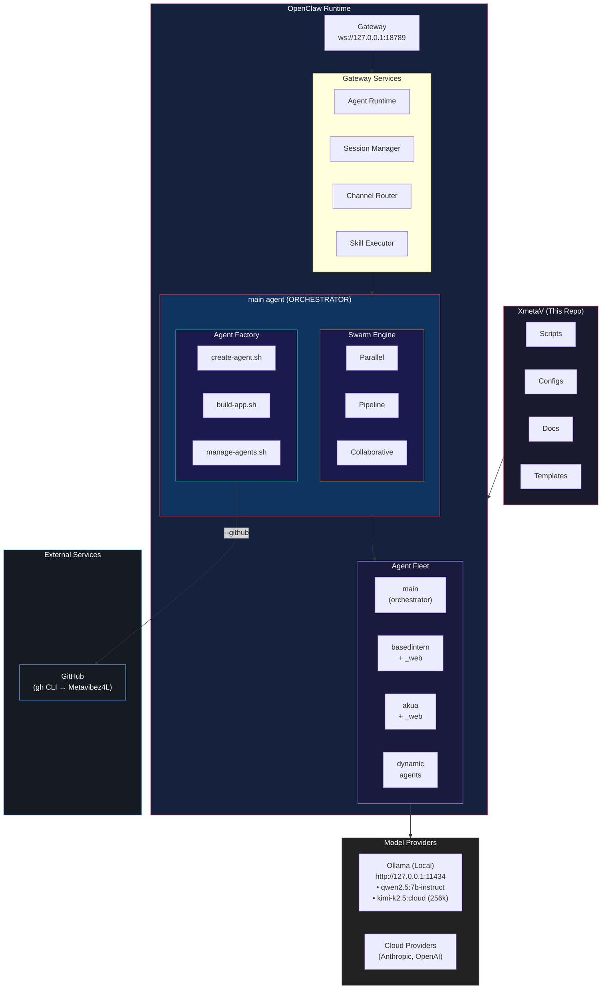
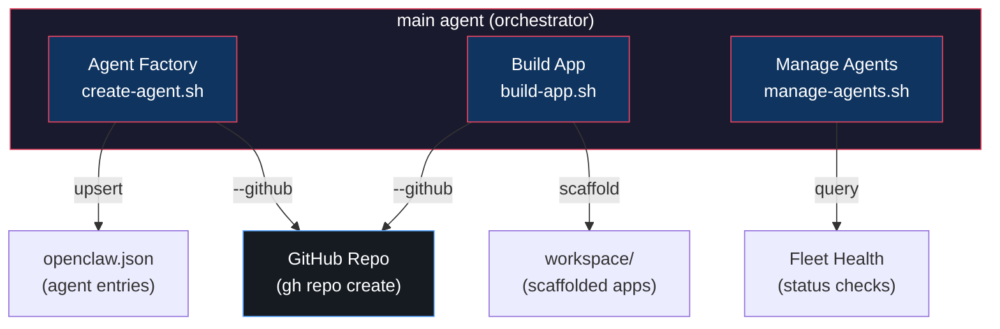
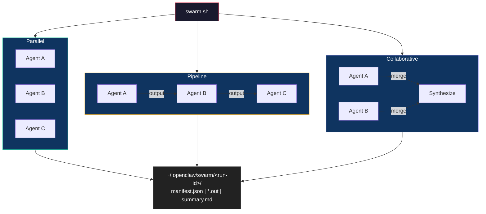
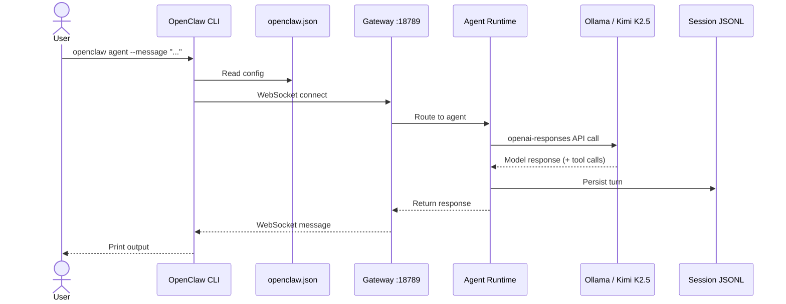
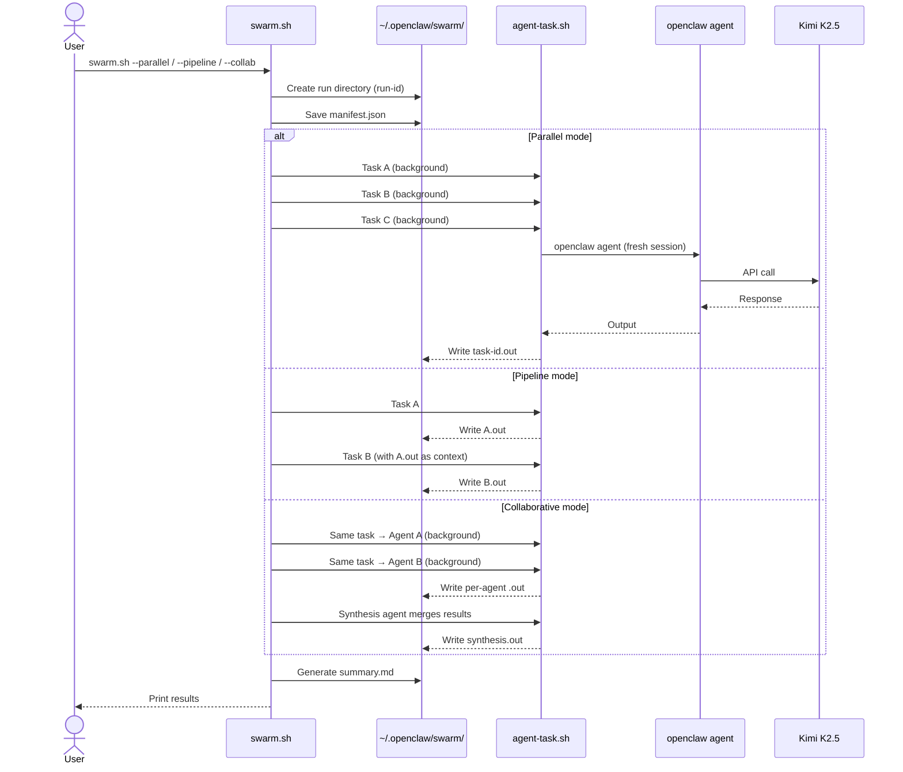
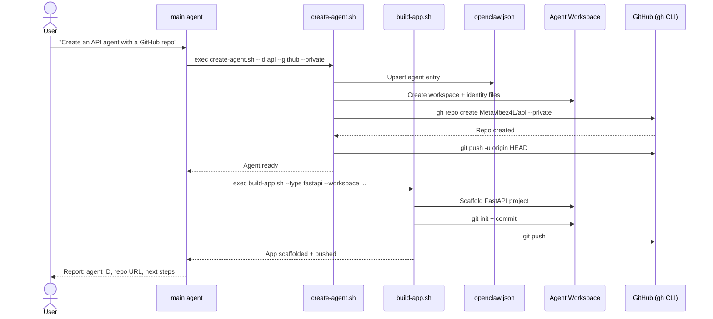

# Architecture — XmetaV OpenClaw Command Center

This repo is a thin operational layer around OpenClaw. It does **not** replace OpenClaw; it makes OpenClaw easier to run, debug, and keep stable on this machine (WSL2/Linux).

## System Overview

## Components

### OpenClaw CLI
- Entry point for everything: `openclaw ...`
- Reads configuration from the default state directory.

### State directory
This command center uses the default OpenClaw config (no profile flag needed).

- State directory: `~/.openclaw/`
- Config path: `~/.openclaw/openclaw.json`

OpenClaw also uses per-agent directories under the state dir for sessions.

### Gateway (WebSocket)
OpenClaw uses a WebSocket gateway that the CLI connects to.

- Gateway port: `18789`
- Default bind in this setup: `loopback` (127.0.0.1 only)

**Golden path for WSL2:** `gateway.mode = "local"`
- Keeps routing simple.
- Avoids confusion between gateway port and any manually-set remote URL.
- Avoids relying on systemd services (not available here).

### Agent runtime
`openclaw agent ...` runs a single agent turn via the Gateway.

Important practical details:
- Sessions are persisted as JSONL files.
- Locks are created as `*.jsonl.lock` to protect concurrent writers.
- Stale locks (e.g., from a crash) can hang future runs.

### Agents

Static agents are defined in `openclaw.json`. Dynamic agents can be created at runtime by the `main` agent via the Agent Factory.

| Agent | Model | Workspace | Tools | Purpose |
|-------|-------|-----------|-------|---------|
| `main` (default) | `kimi-k2.5:cloud` (256k) | `~/.openclaw/workspace` | **full** | **Orchestrator** — command center + agent factory + swarm |
| `basedintern` | `kimi-k2.5:cloud` (256k) | `/home/manifest/basedintern` | coding | Repo agent — code/tests/commits (lean, fast) |
| `basedintern_web` | `kimi-k2.5:cloud` (256k) | `/home/manifest/basedintern` | full | Same repo — browser/web automation only |
| `akua` | `kimi-k2.5:cloud` (256k) | `/home/manifest/akua` | coding | Solidity/Hardhat repo agent |
| `akua_web` | `kimi-k2.5:cloud` (256k) | `/home/manifest/akua` | full | Same repo — browser/web automation only |
| _(dynamic)_ | `kimi-k2.5:cloud` | _(per-agent)_ | _(per-agent)_ | Created on-demand by Agent Factory |

### Agent Factory (Orchestrator Layer)

The `main` agent has an **Agent Factory** skill that enables it to:

1. **Create agents** — add new entries to `openclaw.json` with workspace + identity files
2. **Scaffold apps** — generate project starters (Node.js, Python, bots, etc.) in agent workspaces
3. **Manage the fleet** — list, update, remove, health-check all agents
4. **Self-spawn** — autonomously create agents when it identifies the need

Scripts: `XmetaV/scripts/create-agent.sh`, `build-app.sh`, `manage-agents.sh`
Templates: `XmetaV/templates/agents/` (coding, bot, research, devops, general)

### Swarm (Multi-Agent Orchestration)

The main agent has a **Swarm** skill that enables multi-agent task execution:

1. **Parallel** — dispatch independent tasks to multiple agents simultaneously
2. **Pipeline** — chain agents sequentially, passing output as context to the next
3. **Collaborative** — send the same task to multiple agents, then synthesize responses

Script: `XmetaV/scripts/swarm.sh`
Templates: `XmetaV/templates/swarms/` (health-all, ship-all, research-implement, code-review)
Full docs: `docs/SWARM.md`

### Model provider: Ollama (local)
OpenClaw talks to Ollama through its OpenAI-compatible API.

- Ollama base: `http://127.0.0.1:11434`
- OpenAI-compat base (this setup): `http://127.0.0.1:11434/v1`
- API key: `"local"` (required placeholder for OpenClaw auth checks)

**Golden path for agents (this repo):** `models.providers.ollama.api = "openai-responses"`

Why: `openai-responses` supports **tool calling** (function/tool schemas are sent to the model). If you use `openai-completions`, the model may "narrate" tool usage but cannot actually execute tools.

Practical note for small local models (e.g. 7B):
- If the agent hangs or loops calling tools (commonly `tts`), restrict tools with `tools.profile = "minimal"` and deny `tts`.

## Data flow

### Single agent turn

### Swarm execution

### Agent Factory flow

All agents use **Kimi K2.5** (256k context) via Ollama as the model provider.

## Ports and endpoints

- Gateway WS: `ws://127.0.0.1:18789`
- Ollama HTTP: `http://127.0.0.1:11434`

## Failure modes (what this repo is designed to prevent)

- **1006 (WebSocket closed)**: usually means the CLI connected to the wrong place/port or no gateway was running.
- **Agent hangs**: often caused by wrong provider API mode (completions vs chat), or stale session locks.
- **Stale locks**: `*.jsonl.lock` left behind can block forever.

This repo provides scripts and runbooks to make these problems quick to detect and fix.

- **Agent limit exceeded**: MAX_AGENTS guard prevents runaway self-spawning (default: 10). Increase with `MAX_AGENTS=20` env var.
- **Duplicate agent**: `create-agent.sh` is idempotent — running twice with the same ID updates rather than duplicates.
