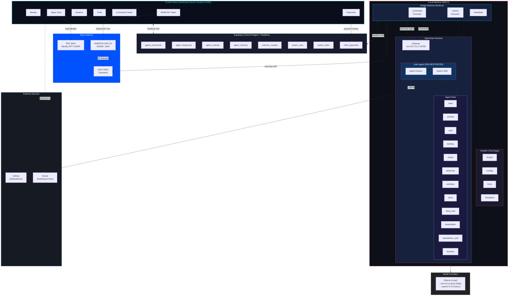
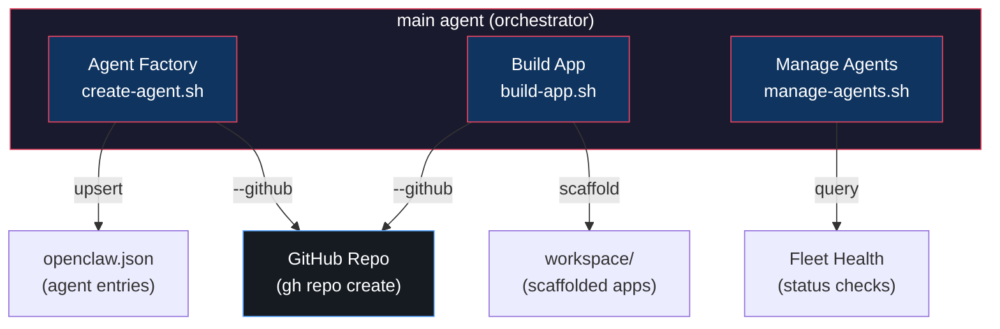
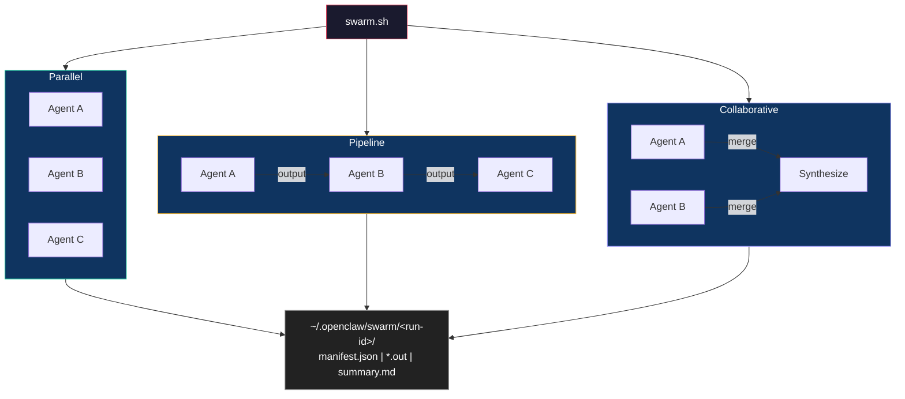
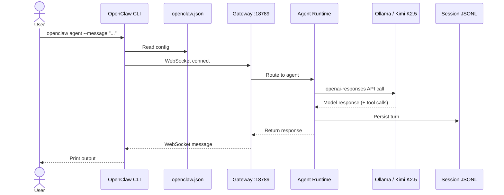
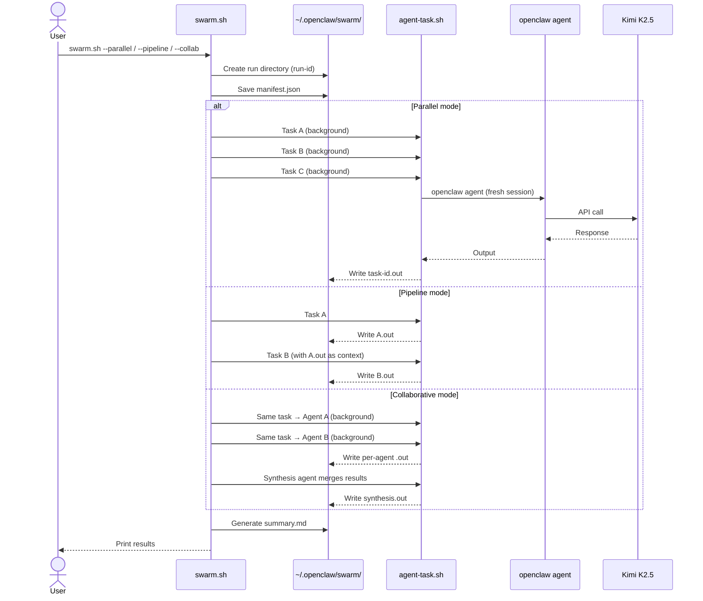
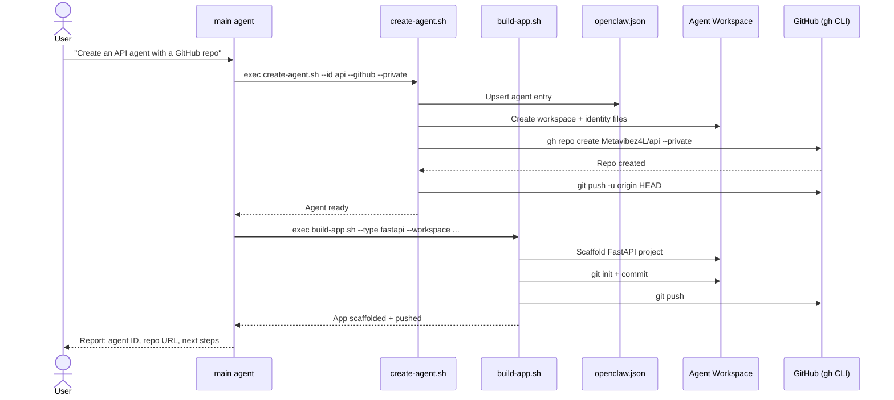
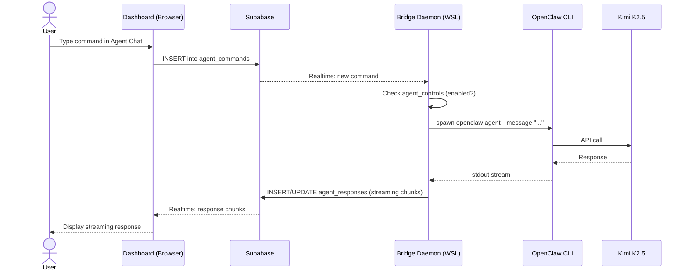
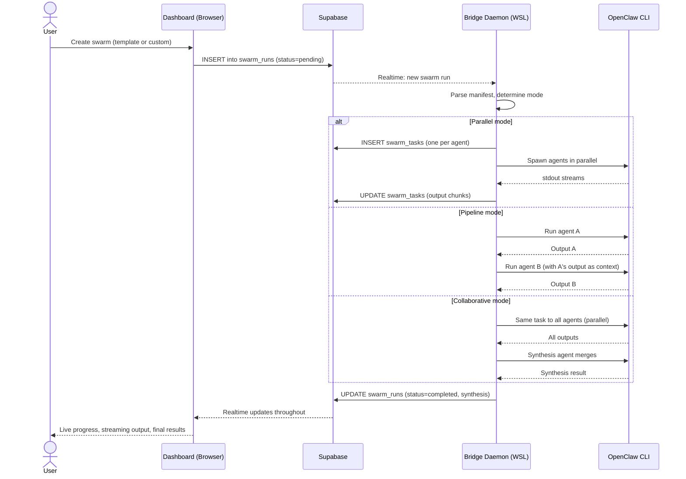

# Architecture — XmetaV OpenClaw Command Center

This repo is the operational layer around OpenClaw. It provides a **Control Plane Dashboard** (Next.js + Supabase), a **Bridge Daemon** (Node.js), automation scripts, and documentation to manage OpenClaw agents, swarms, and infrastructure on WSL2/Linux.

## System Overview

## Components

### Control Plane Dashboard (Next.js 16)

A cyberpunk-themed web application providing a browser-based control interface for the entire XmetaV ecosystem.

- **Framework**: Next.js 16 (App Router) with TypeScript
- **Styling**: Tailwind CSS + shadcn/ui primitives + custom cyberpunk theme
- **Auth**: Supabase Auth (email/password)
- **Hosting**: Vercel (production) or localhost:3000 (development)
- **Pages**: Command Center, Agent Chat, Swarms, Fleet, Payments, Identity, $XMETAV Token, XMETAV HQ (Arena), Live Logs, Consciousness, Memory Cosmos

### XMETAV HQ — Isometric Office Visualization (PixiJS)

A standalone fullscreen page (`/arena`) rendering an isometric cyberpunk office in real-time using PixiJS (WebGL).

- **Renderer**: PixiJS v8.16.0 with dynamic imports (SSR-safe via `next/dynamic`)
- **Isometric Engine**: Custom `iso.ts` with 2:1 projection, tile/cube/wall drawing primitives
- **Office Layout**: Command room (Main + Operator visualization orb), meeting area (hex table + projector), Intel room, Dev floor, Soul office alcove
- **Agent Avatars**: Glowing translucent orbs with ghost silhouettes — idle (breathing pulse), busy (spinning ring), offline (static flicker)
- **Reactive Furniture**: Holo screens on every desk animate based on agent state (scrolling code, red flicker, dim)
- **Real-Time Effects**: Command pulses travel office pathways, streaming particles rise from desks, dispatch beams route through meeting table, completion bursts, failure glitches
- **Data Source**: `useArenaEvents` hook subscribes to Supabase Realtime channels (sessions, commands, responses, controls) and drives PixiJS imperatively via refs (plus 10s periodic sync)
- **HUD**: DOM overlay with title, system status, agent legend, and floating labels computed from isometric coordinates
- **Location**: `dashboard/src/components/arena/` (ArenaCanvas, agents, useArenaEvents, renderer/)

### Supabase (Message Bus + Database)

Supabase acts as the communication layer between the remote dashboard and the local bridge daemon.

- **Database**: Postgres with RLS policies for all tables (authenticated SELECT on all user-facing tables; dream tables have both authenticated SELECT and service-role ALL)
- **Realtime**: WebSocket subscriptions for live updates (commands, responses, swarm status)
- **Tables**: `agent_commands`, `agent_responses`, `agent_sessions`, `agent_controls`, `agent_memory`, `memory_associations`, `memory_queries`, `dream_insights`, `soul_dream_manifestations`, `soul_dream_sessions`, `soul_association_modifications`, `memory_crystals`, `memory_fusions`, `memory_summons`, `limit_breaks`, `memory_achievements`, `daily_quests`, `swarm_runs`, `swarm_tasks`, `x402_payments`, `intent_sessions`
- **Indexes**: `agent_memory(source)`, `memory_associations(memory_id, related_memory_id)` composite
- **Project**: `ptlneqcjsnrxxruutsxm`

### Bridge Daemon (Node.js)

A local Node.js process (runs on WSL alongside OpenClaw) that bridges the remote dashboard to the local OpenClaw CLI.

- **Command Executor**: Subscribes to `agent_commands` via Realtime, spawns `openclaw agent` processes, streams output to `agent_responses`
- **Swarm Executor**: Subscribes to `swarm_runs` via Realtime, orchestrates multi-agent tasks (parallel/pipeline/collaborative), updates `swarm_tasks` with live output
- **Heartbeat**: Periodic status updates so the dashboard knows the bridge is alive
- **Agent Controls**: Checks `agent_controls` table before executing commands (disabled agents are blocked)
- **Graceful Shutdown**: SIGTERM handler unsubscribes Realtime channels, sets session offline, removes PID file
- **Sequential Command Execution**: `processPendingCommands` awaits each command before processing the next
- **x402 Client**: Wraps fetch with automatic 402 payment handling via `@x402/fetch` + `viem` signer
- **Location**: `dashboard/bridge/`

### x402 Payment Service (Express)

A standalone Express server that gates XmetaV API endpoints with USDC micro-payments via the x402 protocol (Coinbase CDP facilitator with JWT auth).

- **Middleware**: `paymentMiddleware` from `@x402/express` gates endpoints with price + network requirements
- **Endpoints**: `/agent-task` ($0.10), `/intent` ($0.05), `/fleet-status` ($0.01), `/swarm` ($0.50), `/memory-crystal` ($0.05), `/neural-swarm` ($0.10), `/fusion-chamber` ($0.15), `/cosmos-explore` ($0.20), `/voice/transcribe` ($0.05), `/voice/synthesize` ($0.08), `/execute-trade` ($0.50+), `/rebalance-portfolio` ($2.00+), `/arb-opportunity` ($0.25), `/execute-arb` ($0.10+), `/yield-optimize` ($0.50), `/deploy-yield-strategy` ($3.00+)
- **ERC-8004 Identity MW**: Resolves caller agent via `X-Agent-Id` header (on-chain lookup → `req.callerAgent`)
- **Discovery**: `GET /agent/:agentId/payment-info` — public ERC-8004 lookup with x402 detection
- **Payment Logging**: Writes to `x402_payments` Supabase table (agent_id, payer/payee, network, metadata)
- **Token Tiers**: Checks caller's $XMETAV balance on-chain and applies tier discount to pricing
- **Free endpoints**: `/health`, `/token-info`, `/agent/:agentId/payment-info`, `/digest`, `/trade-fees`
- **Settlement**: USDC on Base Mainnet
- **Facilitator**: `@coinbase/x402` CDP facilitator with `CDP_API_KEY_ID` + `CDP_API_KEY_SECRET` JWT auth
- **Location**: `dashboard/x402-server/`

### ERC-8004 Agent Identity

On-chain identity for the XmetaV agent using the ERC-8004 standard (ERC-721 NFTs) on Base mainnet.

- **Agent ID**: 16905 (minted via `IdentityRegistryUpgradeable`)
- **Identity Contract**: `0x8004A169FB4a3325136EB29fA0ceB6D2e539a432`
- **Reputation Contract**: `0x8004b1041543F0eB1f3459E8a2FC4Ab06ceC7251`
- **Registration**: `register.ts` script mints the agent NFT with a metadata URI
- **Client Library**: `lib/client.ts` reads identity and reputation data via `viem`
- **Location**: `dashboard/erc8004/`

### $XMETAV Token (ERC-20)

Native utility token on Base Mainnet providing tiered discounts on x402-gated endpoints.

- **Contract**: `0x5b56CD209e3F41D0eCBf69cD4AbDE03fC7c25b54` (ERC-20, OpenZeppelin Ownable)
- **Supply**: 1,000,000,000 (1B) fixed — all minted to deployer at construction
- **Tiers**: None → Starter (10%) → Bronze (15%) → Silver (25%) → Gold (50%) → Diamond (75% discount)
- **Integration**: x402 server middleware reads `balanceOf()` on-chain to apply tier discount
- **Dashboard**: `/token` page, balance + tier badge on `/identity` and `/payments`
- **API**: `/api/token?wallet=0x...` returns balance, tier, discount
- **Location**: `dashboard/token/` (Hardhat project), `dashboard/src/lib/token-tiers.ts`

### Soul Agent (Memory Orchestrator + Lucid Dreaming)

A dedicated agent that sits between task dispatch and agent execution, curating context, building memory associations, consolidating memories during fleet idle periods, and autonomously proposing evolution actions.

- **Room**: SOUL (private magenta alcove in Arena, cols 0–1, rows 2–5)
- **Bridge Library**: `dashboard/bridge/lib/soul/` — context building, memory retrieval, association building, dream mode, dream proposals, type definitions
- **DB Tables**: `memory_associations`, `memory_queries`, `dream_insights`, `soul_dream_manifestations`, `soul_dream_sessions`, `soul_association_modifications`
- **Dream Mode**: When all agents are idle, Soul consolidates recent memories into clusters, generates insights, and saves them for future context injection
- **Lucid Dreaming (Phase 5)**: During dream cycles, Soul generates actionable manifestations (proposals) across 7 categories: fusion, association, pricing, skill, meeting, pattern, correction. High-confidence safe proposals auto-execute; others await user approval via `/api/soul` or the Consciousness page
- **Association Building**: After each new memory entry, Soul automatically builds associations (causal, similar, sequential, related) with existing memories
- **Self-Modification**: Soul can propose and auto-execute association reinforcements, creating new links or boosting weak ones based on dream analysis
- **Context Packets**: Soul builds contextual memory packets injected into agent prompts at dispatch time
- **Arena**: Surveillance desk with mini fleet-monitor screens that mirror every agent's screen state; observer seat at meetings (195°)
- **API Route**: `GET/POST /api/soul` — proposals listing, stats, sessions, approve/reject, manual dream trigger
- **ERC-8004**: Listed in `fleet.agents` with 6 soul-specific capabilities
- **Location**: `dashboard/bridge/lib/soul/`, `dashboard/scripts/setup-db-soul.sql`, `dashboard/supabase/migrations/20260215220000_lucid_dreaming.sql`

### Memory Crystal System (Cyber-Neural Memory Evolution)

A Final-Fantasy-inspired memory gamification layer at `/memory-cosmos` with 7 interconnected subsystems.

- **Crystal Materia**: Living memory crystals with XP, 30 levels, star ratings (1-6★), and class evolution (anchor → mage → knight → sage → rogue → summoner → ninja → godhand)
- **Crystal Fusion**: 5 FF7-style fusion recipes (Nexus, Prophecy, Storm, Phantom, Infinity) with animated 4-phase fusion chamber
- **Memory Summons**: Keyword-triggered crystal summoning with animated triple summoning circles
- **Limit Breaks**: Triggered at 10+ crystals with 500+ total XP; creates legendary 6★ godhand crystal
- **Memory Cosmos**: Pannable/zoomable explorable world map with golden-spiral island layout, 3 terrain types, neon highway bridges with data particles
- **Achievements**: 7 seeded achievements with Bronze/Silver/Gold/Legendary tiers
- **Daily Quests**: Auto-generated daily quests with type-based objectives and XP rewards
- **Bridge Engine**: `dashboard/bridge/lib/memory-crystal.ts` — full game logic (~530 lines)
- **DB Tables**: `memory_crystals`, `memory_fusions`, `memory_summons`, `limit_breaks`, `memory_achievements`, `daily_quests` (3 custom enums, `crystal_level_thresholds` view)
- **Hook**: `useMemoryCrystals` — Supabase queries + realtime subscriptions, 12s auto-refresh
- **Components**: CrystalCard (canvas), CrystalInventory, FusionChamber, SummonOverlay, LimitBreakBanner, MemoryCosmos, QuestTracker
- **Location**: `dashboard/src/components/crystals/`, `dashboard/src/hooks/useMemoryCrystals.ts`, `dashboard/bridge/lib/memory-crystal.ts`

### OpenClaw CLI
- Entry point for everything: `openclaw ...`
- Reads configuration from the default state directory.

### State directory
This command center uses the default OpenClaw config (no profile flag needed).

- State directory: `~/.openclaw/`
- Config path: `~/.openclaw/openclaw.json`

OpenClaw also uses per-agent directories under the state dir for sessions.

### Gateway (WebSocket)
OpenClaw uses a WebSocket gateway that the CLI connects to.

- Gateway port: `18789`
- Default bind in this setup: `loopback` (127.0.0.1 only)

**Golden path for WSL2:** `gateway.mode = "local"`
- Keeps routing simple.
- Avoids confusion between gateway port and any manually-set remote URL.
- Avoids relying on systemd services (not available here).

### Agent runtime
`openclaw agent ...` runs a single agent turn via the Gateway.

Important practical details:
- Sessions are persisted as JSONL files.
- Locks are created as `*.jsonl.lock` to protect concurrent writers.
- Stale locks (e.g., from a crash) can hang future runs.

### Agents

Static agents are defined in `openclaw.json`. Dynamic agents can be created at runtime by the `main` agent via the Agent Factory.

| Agent | Model | Workspace | Tools | Purpose |
|-------|-------|-----------|-------|---------|
| `main` (default) | `kimi-k2.5:cloud` (256k) | `~/.openclaw/workspace` | **full** | **Orchestrator** — command center + agent factory + swarm |
| `basedintern` | `kimi-k2.5:cloud` (256k) | `/home/manifest/basedintern` | coding | Repo agent — code/tests/commits (lean, fast) |
| `basedintern_web` | `kimi-k2.5:cloud` (256k) | `/home/manifest/basedintern` | full | Same repo — browser/web automation only |
| `akua` | `kimi-k2.5:cloud` (256k) | `/home/manifest/akua` | coding | Solidity/Hardhat repo agent |
| `akua_web` | `kimi-k2.5:cloud` (256k) | `/home/manifest/akua` | full | Same repo — browser/web automation only |
| `soul` | `kimi-k2.5:cloud` (256k) | `~/.openclaw/agents/soul` | coding | **Memory Orchestrator** — context curation, dream consolidation, associations |
| _(dynamic)_ | `kimi-k2.5:cloud` | _(per-agent)_ | _(per-agent)_ | Created on-demand by Agent Factory |

### Agent Factory (Orchestrator Layer)

The `main` agent has an **Agent Factory** skill that enables it to:

1. **Create agents** — add new entries to `openclaw.json` with workspace + identity files
2. **Scaffold apps** — generate project starters (Node.js, Python, bots, etc.) in agent workspaces
3. **Manage the fleet** — list, update, remove, health-check all agents
4. **Self-spawn** — autonomously create agents when it identifies the need

Scripts: `XmetaV/scripts/create-agent.sh`, `build-app.sh`, `manage-agents.sh`
Templates: `XmetaV/templates/agents/` (coding, bot, research, devops, general)

### Swarm (Multi-Agent Orchestration)

The main agent has a **Swarm** skill that enables multi-agent task execution:

1. **Parallel** — dispatch independent tasks to multiple agents simultaneously
2. **Pipeline** — chain agents sequentially, passing output as context to the next
3. **Collaborative** — send the same task to multiple agents, then synthesize responses

Script: `XmetaV/scripts/swarm.sh`
Templates: `XmetaV/templates/swarms/` (health-all, ship-all, research-implement, code-review)
Full docs: `docs/SWARM.md`

### Model provider: Ollama (local)
OpenClaw talks to Ollama through its OpenAI-compatible API.

- Ollama base: `http://127.0.0.1:11434`
- OpenAI-compat base (this setup): `http://127.0.0.1:11434/v1`
- API key: `"local"` (required placeholder for OpenClaw auth checks)

**Golden path for agents (this repo):** `models.providers.ollama.api = "openai-responses"`

Why: `openai-responses` supports **tool calling** (function/tool schemas are sent to the model). If you use `openai-completions`, the model may "narrate" tool usage but cannot actually execute tools.

Practical note for small local models (e.g. 7B):
- If the agent hangs or loops calling tools (commonly `tts`), restrict tools with `tools.profile = "minimal"` and deny `tts`.

## Data flow

### Single agent turn

### Swarm execution

### Agent Factory flow

All agents use **Kimi K2.5** (256k context) via Ollama as the model provider.

### Dashboard command flow

### Dashboard swarm flow

## Ports and endpoints

- Dashboard: `http://localhost:3000` (dev) or Vercel URL (prod)
- Gateway WS: `ws://127.0.0.1:18789`
- Ollama HTTP: `http://127.0.0.1:11434`
- Supabase: `https://ptlneqcjsnrxxruutsxm.supabase.co`

## Failure modes (what this repo is designed to prevent)

- **1006 (WebSocket closed)**: usually means the CLI connected to the wrong place/port or no gateway was running.
- **Agent hangs**: often caused by wrong provider API mode (completions vs chat), or stale session locks.
- **Stale locks**: `*.jsonl.lock` left behind can block forever.

This repo provides scripts and runbooks to make these problems quick to detect and fix.

- **Agent limit exceeded**: MAX_AGENTS guard prevents runaway self-spawning (default: 10). Increase with `MAX_AGENTS=20` env var.
- **Duplicate agent**: `create-agent.sh` is idempotent — running twice with the same ID updates rather than duplicates.

## API Security Architecture

All dashboard API routes are protected with a shared auth guard pattern.

- **Auth Utility**: `dashboard/src/lib/api-auth.ts` — shared helpers for API route security
  - `requireAuth()` — reads Supabase session from SSR cookies, returns `{ user }` or `{ error: NextResponse(401) }`
  - `isValidUUID(s)` — regex validation for UUID params (prevents injection)
  - `clampLimit(raw, defaultVal, maxVal)` — safe parseInt with bounds (prevents unbounded result sets)
- **Protected Routes**: `/api/soul`, `/api/agents/memory`, `/api/midas`, `/api/erc8004/identity`, `/api/anchors`
- **Already Protected**: `/api/terminal` (uses `createClient()` + `getUser()` directly)
- **Pattern**: Every handler starts with `const auth = await requireAuth(); if (auth.error) return auth.error;`
- **Admin Client**: Routes that need cross-user data use `createAdminClient()` (service_role key) but still require an authenticated session first

## Performance Architecture

- **Explicit Column Selection**: All Supabase queries use explicit column lists instead of `SELECT *` to minimize payload size
- **Query Bounds**: All unbounded queries have `.limit()` caps (dream cycle: 500, manifestation stats: 1000, consciousness hook: 30-500 per table)
- **Batch Queries**: Dream proposal engine collects all memory IDs across clusters and executes a single batched association query instead of per-cluster N+1
- **Polling Intervals**: Dashboard consciousness hook polls at 30s (previously 15s), arena syncs at 10s
- **Canvas Optimization**: Force simulations use Map lookups for O(1) edge resolution; `setTransform()` prevents cumulative scaling; `document.hidden` stops rendering in backgrounded tabs
- **Build**: `optimizePackageImports` for lucide-react tree-shaking; `serverExternalPackages` for pg to prevent client bundling
