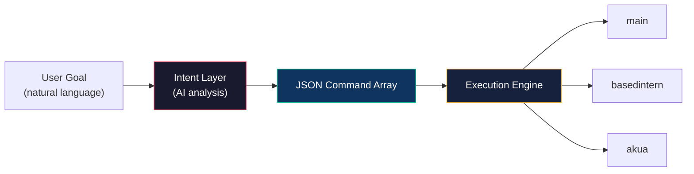

# Intent Layer — AI-Powered Command Generation

The Intent Layer is the natural language interface for the XmetaV agent orchestration system. It analyzes high-level user goals and produces structured JSON command arrays that can be executed across the agent fleet.

## Overview



The Intent Layer bridges the gap between what a user wants to accomplish and the specific agent commands needed to achieve it. Instead of manually crafting `openclaw agent` commands, users express their intent and the layer handles:

1. **Goal decomposition** — Breaking complex objectives into atomic tasks
2. **Agent routing** — Selecting the best agent for each task
3. **Dependency ordering** — Sequencing commands logically
4. **Verification** — Including validation steps where appropriate

## Command Format

Each command in the output array follows this structure:

```json
{
  "agent": "basedintern",
  "message": "Run npm test and report failures",
  "description": "Health check basedintern repo"
}
```

| Field | Required | Description |
|-------|----------|-------------|
| `agent` | yes | Target agent ID (`main`, `basedintern`, `akua`, `basedintern_web`, `akua_web`) |
| `message` | yes | Specific, actionable task for the agent to execute |
| `description` | yes | Short human-readable summary of what this command does |

## Available Agents

| Agent | Model | Workspace | Tools | Best For |
|-------|-------|-----------|-------|----------|
| `main` | `kimi-k2.5:cloud` | `~/.openclaw/workspace` | **full** | Orchestration, research, system tasks, documentation |
| `basedintern` | `kimi-k2.5:cloud` | `/home/manifest/basedintern` | coding | TypeScript/Node.js repo work (code, tests, commits) |
| `akua` | `kimi-k2.5:cloud` | `/home/manifest/akua` | coding | Solidity/Hardhat/Go work (contracts, tests, deploys) |
| `basedintern_web` | `kimi-k2.5:cloud` | `/home/manifest/basedintern` | full | Browser automation for basedintern tasks |
| `akua_web` | `kimi-k2.5:cloud` | `/home/manifest/akua` | full | Browser automation for akua tasks |

## Routing Rules

The Intent Layer follows these rules when assigning agents to tasks:

1. **Use `main`** for:
   - Coordination and orchestration
   - Research and information gathering
   - Documentation updates
   - System configuration and diagnostics
   - Synthesis and summarization
   - Tasks that span multiple repos

2. **Use `basedintern`** for:
   - TypeScript/Node.js code changes
   - Running `npm test`, `npx tsc`, etc.
   - Git operations in the basedintern repo
   - Based Intern project-specific work

3. **Use `akua`** for:
   - Solidity smart contract work
   - Hardhat compile/test/deploy
   - Go operations
   - Akua project-specific work

4. **Use `_web` variants** ONLY when:
   - Browser automation is explicitly required
   - Web scraping or interaction is needed
   - These use the full tool profile (20+ tools) — use sparingly to save quota

5. **Command ordering**:
   - Dependencies first (e.g., install before test)
   - Research before implementation
   - Implementation before verification
   - Include verification/validation steps for important operations

## Examples

### Update documentation and status

**Goal**: "update docs, status"

```json
[
  {
    "agent": "main",
    "message": "Read docs/STATUS.md and update verification dates to today. Add any new capabilities that have been implemented.",
    "description": "Update STATUS.md with current state"
  },
  {
    "agent": "main",
    "message": "Read docs/GITHUB-SKILL-STATUS.md and update the Last Verified date to today.",
    "description": "Refresh GitHub skill verification date"
  },
  {
    "agent": "main",
    "message": "Update README.md changelog with today's changes and ensure all documentation references are current.",
    "description": "Update README changelog and references"
  },
  {
    "agent": "main",
    "message": "Verify all doc files are internally consistent and cross-references are valid.",
    "description": "Verify documentation consistency"
  }
]
```

### Health check all repos

**Goal**: "check health of all repos"

```json
[
  {
    "agent": "basedintern",
    "message": "Run npm test and npx tsc --noEmit. Report all failures with file paths and error messages.",
    "description": "Health check basedintern repo"
  },
  {
    "agent": "akua",
    "message": "Run npx hardhat compile and npx hardhat test. Report all failures with contract names and error messages.",
    "description": "Health check akua repo"
  },
  {
    "agent": "main",
    "message": "Summarize the health check results from basedintern and akua. Flag any critical issues.",
    "description": "Synthesize health check results"
  }
]
```

### Research and implement a feature

**Goal**: "research error handling best practices and apply to basedintern"

```json
[
  {
    "agent": "main",
    "message": "Research current best practices for error handling in TypeScript/Node.js applications. Focus on: custom error classes, error boundaries, async error handling, and logging patterns. Produce a summary with actionable recommendations.",
    "description": "Research TypeScript error handling best practices"
  },
  {
    "agent": "basedintern",
    "message": "Review the current error handling patterns in the codebase. Identify files and functions that lack proper error handling. List specific locations that need improvement.",
    "description": "Audit current error handling in basedintern"
  },
  {
    "agent": "basedintern",
    "message": "Apply the error handling best practices from the research to the identified locations. Create custom error classes if needed. Ensure all async operations have proper try/catch blocks.",
    "description": "Implement error handling improvements"
  },
  {
    "agent": "basedintern",
    "message": "Run npm test and npx tsc --noEmit to verify the changes don't break anything. Report results.",
    "description": "Verify changes pass tests and typecheck"
  }
]
```

### Deploy and verify

**Goal**: "deploy akua contracts to testnet and verify"

```json
[
  {
    "agent": "akua",
    "message": "Run npx hardhat compile to ensure all contracts compile cleanly. Report any warnings.",
    "description": "Compile contracts before deployment"
  },
  {
    "agent": "akua",
    "message": "Run npx hardhat test to verify all tests pass before deployment.",
    "description": "Run contract tests"
  },
  {
    "agent": "akua",
    "message": "Deploy contracts to the configured testnet using npx hardhat deploy. Record deployed addresses.",
    "description": "Deploy contracts to testnet"
  },
  {
    "agent": "akua_web",
    "message": "Use the browser to navigate to the block explorer and verify the deployed contracts are visible and verified.",
    "description": "Verify deployment on block explorer"
  }
]
```

## Integration with Swarm

Intent Layer output can be fed directly into the swarm engine for automated execution:

```bash
# The Intent Layer produces a command array
# The swarm engine can execute it as a parallel or pipeline operation

# Example: convert intent commands to a swarm manifest
./scripts/swarm.sh --parallel \
  basedintern "Run npm test and report failures" \
  akua "Run npx hardhat compile and report warnings"
```

For complex multi-step workflows, the Intent Layer's ordered command array maps naturally to the swarm's **pipeline** mode, where each command's output provides context for the next.

## System Prompt Reference

The Intent Layer uses a system prompt that:

1. Defines all available agents and their capabilities
2. Specifies the JSON output format
3. Enforces routing rules (agent selection, ordering, verification)
4. Restricts output to only the JSON command array (no markdown, no commentary)

The full system prompt is maintained alongside the agent configuration and can be customized to add new agents or modify routing behavior.

## Best Practices

1. **Be specific in goals** — "Update docs" is good; "make things better" is too vague
2. **One goal at a time** — Complex goals are decomposed automatically, but start focused
3. **Trust the routing** — The layer knows which agent handles what
4. **Review before executing** — Inspect the generated commands before running them
5. **Use for planning** — Even if you execute manually, the command array is a good plan
