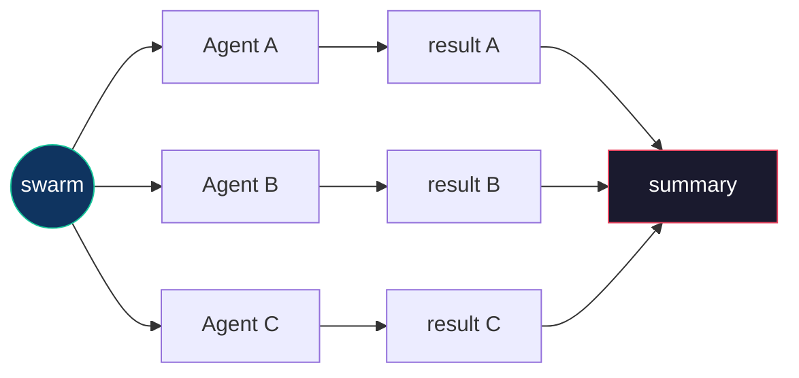
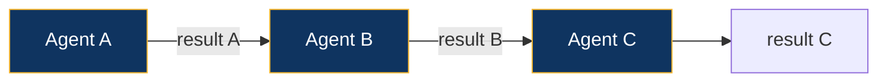
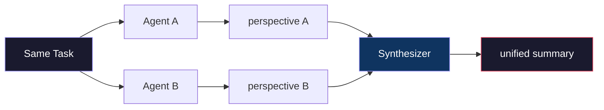
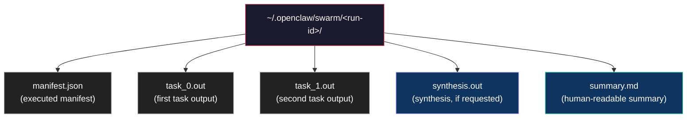

# Swarm — Multi-Agent Orchestration

The swarm system enables the main agent (or you directly) to decompose complex tasks and dispatch them across the agent fleet using three execution modes.

## Quick Start

```bash
# Parallel: health check all repos at once
./scripts/swarm.sh --parallel \
  basedintern "Run /repo-health" \
  akua "Run /repo-health"

# Pipeline: research then implement
./scripts/swarm.sh --pipeline \
  main "Research best practices for error handling in TypeScript" \
  basedintern "Apply the findings from context to the codebase"

# Collaborative: multiple agents review the same problem
./scripts/swarm.sh --collab "Review security of the authentication flow" \
  basedintern akua

# From a pre-built template
./scripts/swarm.sh templates/swarms/health-all.json

# Check past runs
./scripts/swarm.sh --status

# Read results
./scripts/swarm.sh --results swarm_20260206_143022_12345
```

## Execution Modes

### Parallel

All tasks run simultaneously. Best for independent operations.



**Use when:** Tasks don't depend on each other (health checks, status across repos, data gathering).

### Pipeline

Tasks run sequentially. Each task's output becomes context for the next.



**Use when:** Later steps need output from earlier ones (research -> implement, analyze -> fix -> verify).

### Collaborative

Same task sent to multiple agents. A synthesizer merges the responses.



**Use when:** Multiple viewpoints improve quality (code review, security audit, architecture analysis).

## Manifest Format

For complex operations, write a JSON manifest:

### Parallel

```json
{
  "mode": "parallel",
  "tasks": [
    { "id": "tests", "agent": "basedintern", "message": "Run npm test" },
    { "id": "compile", "agent": "akua", "message": "Run /repo-ops compile" }
  ],
  "on_failure": "continue",
  "synthesize": true,
  "synthesize_agent": "main"
}
```

### Pipeline

```json
{
  "mode": "pipeline",
  "tasks": [
    { "id": "research", "agent": "main", "message": "Research X" },
    { "id": "implement", "agent": "basedintern", "message": "Implement findings", "depends_on": "research" },
    { "id": "verify", "agent": "basedintern", "message": "Run tests", "depends_on": "implement" }
  ],
  "on_failure": "stop"
}
```

### Collaborative

```json
{
  "mode": "collaborative",
  "task": "Review the security of our smart contracts",
  "agents": ["basedintern", "akua"],
  "synthesize_agent": "main"
}
```

### Field Reference

| Field | Required | Default | Description |
|-------|----------|---------|-------------|
| `mode` | yes | `parallel` | `parallel`, `pipeline`, or `collaborative` |
| `tasks` | parallel/pipeline | -- | Array of task objects |
| `task` | collaborative | -- | Single task string for all agents |
| `agents` | collaborative | -- | Array of agent IDs |
| `on_failure` | no | `continue`/`stop` | `stop` halts on first error; `continue` runs all |
| `synthesize` | no | `false` | Run synthesis after tasks complete |
| `synthesize_agent` | no | `main` | Agent that synthesizes results |

**Task object fields:**

| Field | Required | Default | Description |
|-------|----------|---------|-------------|
| `id` | no | auto | Identifier (used in output filenames) |
| `agent` | yes | `main` | Agent to run this task |
| `message` | yes | -- | Task prompt |
| `timeout` | no | `120` | Seconds before task is killed |
| `depends_on` | no | -- | Pipeline: task ID to wait for |

## Pre-Built Templates

Ready-to-use manifests in `templates/swarms/`:

| Template | Mode | What it does |
|----------|------|-------------|
| `health-all.json` | parallel | Health check basedintern + akua |
| `ship-all.json` | parallel | Typecheck/compile + test across repos |
| `research-implement.json` | pipeline | Research -> implement -> verify |
| `code-review.json` | collaborative | Multi-agent code review |

```bash
./scripts/swarm.sh templates/swarms/health-all.json
```

## Results

All output is stored in `~/.openclaw/swarm/<run-id>/`:



```bash
# List past runs
./scripts/swarm.sh --status

# Read results
./scripts/swarm.sh --results swarm_20260206_143022_12345
```

## Environment Variables

| Variable | Default | Description |
|----------|---------|-------------|
| `SWARM_TIMEOUT` | `120` | Per-task timeout in seconds |
| `SWARM_MAX_PARALLEL` | `4` | Max concurrent tasks |
| `SWARM_DIR` | `~/.openclaw/swarm` | Results directory |

## Agent Routing Guide

| Agent | Best for |
|-------|----------|
| `main` | Synthesis, coordination, system tasks, web research |
| `basedintern` | TypeScript/Node.js code, npm, Based Intern repo |
| `basedintern_web` | Browser/web automation (use sparingly) |
| `akua` | Solidity, Hardhat, smart contracts, Go ops |
| `akua_web` | Web automation for akua tasks (use sparingly) |
| _(dynamic)_ | Whatever they were created for |

## Examples

### Fleet-wide health check

```bash
./scripts/swarm.sh --parallel \
  basedintern "Run /repo-health and report JSON" \
  akua "Run /repo-health and report JSON"
```

### Research-driven development

```bash
./scripts/swarm.sh --pipeline \
  main "Research the latest best practices for Solidity gas optimization" \
  akua "Apply the research findings to optimize gas usage in our contracts" \
  akua "Run /repo-ops compile and /repo-ops test to verify"
```

### Multi-perspective code review

```bash
./scripts/swarm.sh --collab \
  "Review the last commit for bugs, security issues, and code quality" \
  basedintern akua
```

### Complex manifest with synthesis

```bash
cat > /tmp/swarm-audit.json << 'EOF'
{
  "mode": "parallel",
  "tasks": [
    { "id": "bi-tests", "agent": "basedintern", "message": "Run full test suite and report failures" },
    { "id": "bi-types", "agent": "basedintern", "message": "Run typecheck and report errors" },
    { "id": "akua-compile", "agent": "akua", "message": "Compile all contracts and report warnings" },
    { "id": "akua-tests", "agent": "akua", "message": "Run all contract tests" }
  ],
  "on_failure": "continue",
  "synthesize": true,
  "synthesize_agent": "main"
}
EOF

./scripts/swarm.sh /tmp/swarm-audit.json
```
