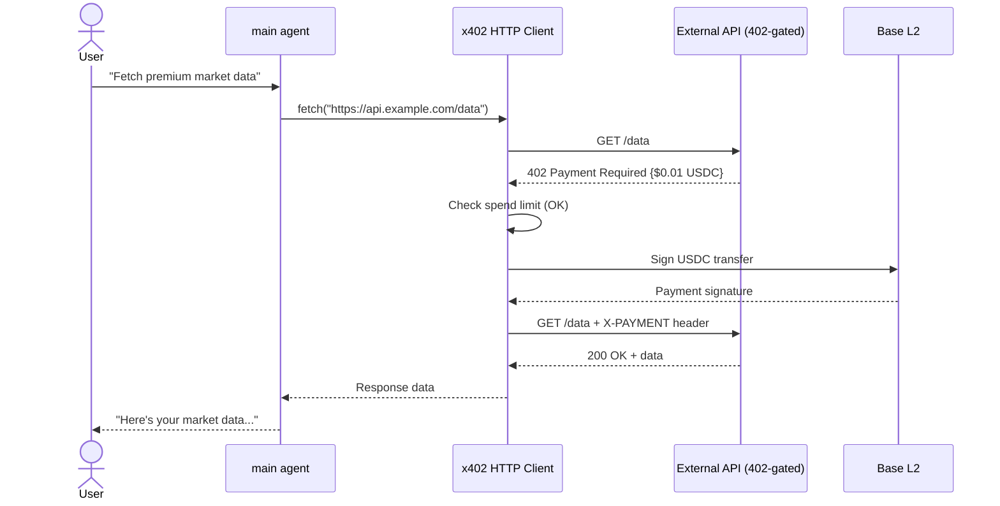
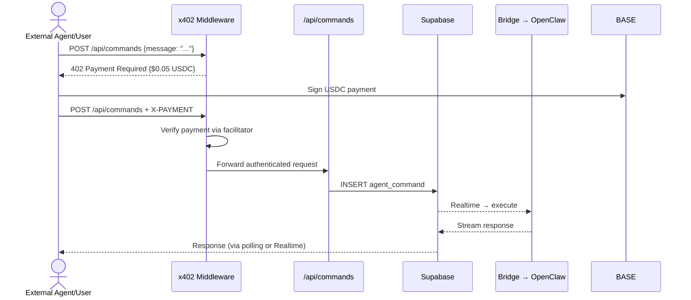
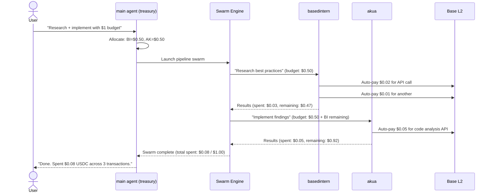
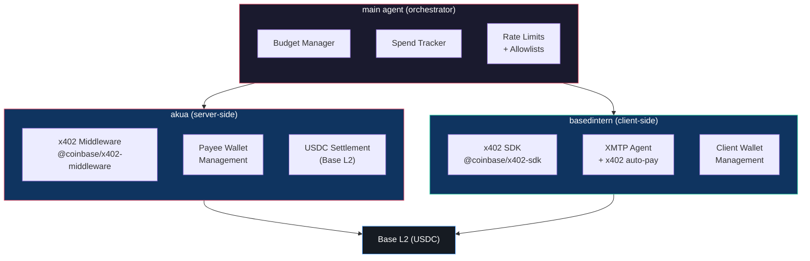

# x402 Payment Protocol — Main Agent Integration Plan

> **Status**: Design Phase  
> **Date**: 2026-02-11  
> **Scope**: Integrating Coinbase x402 autonomous USDC micro-payments into the XmetaV main agent orchestrator

---

## Table of Contents

1. [Executive Summary](#executive-summary)
2. [What is x402?](#what-is-x402)
3. [Integration Patterns](#integration-patterns)
   - [Pattern A: Main Agent as x402 Client (Auto-Pay)](#pattern-a-main-agent-as-x402-client-auto-pay)
   - [Pattern B: Main Agent as x402 Gateway (Monetize Endpoints)](#pattern-b-main-agent-as-x402-gateway-monetize-endpoints)
   - [Pattern C: Main Agent as x402 Budget Manager (Swarm Spend Control)](#pattern-c-main-agent-as-x402-budget-manager-swarm-spend-control)
4. [Recommended First Integration](#recommended-first-integration)
5. [Architecture Diagrams](#architecture-diagrams)
6. [Implementation Roadmap](#implementation-roadmap)
7. [Security Considerations](#security-considerations)
8. [Agent Responsibilities](#agent-responsibilities)

---

## Executive Summary

The [x402 Payment Protocol](https://github.com/coinbase/x402) by Coinbase enables autonomous USDC micro-payments over HTTP on the Base network. It leverages the existing HTTP 402 ("Payment Required") status code to create a seamless pay-per-request flow between AI agents and API services.

**Three integration patterns** are viable for the XmetaV main agent:

| Pattern | Role | Difficulty | Value | Recommended Order |
|---------|------|-----------|-------|-------------------|
| **A: Client (Auto-Pay)** | Main agent pays for 402-gated APIs | Low | High | **1st** |
| **B: Gateway (Monetize)** | Dashboard endpoints gated by x402 | Medium | Medium | 2nd |
| **C: Budget Manager** | Orchestrator tracks swarm spend | High | High | 3rd |

**Recommendation**: Start with **Pattern A** — it's the lowest friction, highest immediate value, and requires no contract deployment. The main agent gains the ability to autonomously pay for any x402-gated service.

---

## What is x402?

x402 is a payment protocol that uses the HTTP 402 status code to enable machine-to-machine payments:

```
┌─────────┐    GET /api/data    ┌─────────┐
│  Client  │ ─────────────────> │  Server  │
│  (Agent) │                    │  (API)   │
│          │ <───────────────── │          │
│          │  402 Payment Req.  │          │
│          │  {amount, payee,   │          │
│          │   asset, network}  │          │
│          │                    │          │
│          │  ── pay USDC ──>   │  Base L2 │
│          │  (on-chain tx)     │          │
│          │                    │          │
│          │  GET /api/data     │          │
│          │  X-PAYMENT: <sig>  │          │
│          │ ─────────────────> │          │
│          │ <───────────────── │          │
│          │  200 OK + data     │          │
└─────────┘                    └─────────┘
```

### Key Components

| Component | Package | Role |
|-----------|---------|------|
| **Server Middleware** | `@coinbase/x402-middleware` | Wraps Express/Hono endpoints with 402 payment gate |
| **Client SDK** | `@coinbase/x402-sdk` | Detects 402, pays USDC on-chain, retries with payment proof |
| **Facilitator** | Coinbase-hosted | Verifies payment proofs and settles on Base |
| **Network** | Base (L2) | Low-cost USDC transfers (~$0.001 per tx) |

### Payment Flow (Detailed)

1. Client sends normal HTTP request to a gated endpoint
2. Server responds with `402 Payment Required` + JSON body containing:
   - `amount`: Price in USDC (e.g., `"0.001"` = 0.1 cent)
   - `payeeAddress`: Server's Base wallet address
   - `asset`: USDC contract address on Base
   - `network`: `"base"` or `"base-sepolia"` (testnet)
   - `facilitatorUrl`: URL to verify payment
3. Client signs a USDC transfer on Base (EIP-3009 `transferWithAuthorization`)
4. Client retries the original request with `X-PAYMENT` header containing the signed payment
5. Server verifies payment via facilitator, then serves the response

---

## Integration Patterns

### Pattern A: Main Agent as x402 Client (Auto-Pay)

> **The main agent autonomously pays for 402-gated external services**

This is the most natural integration. The main agent (and its sub-agents) already make HTTP requests to external services. By wrapping the HTTP client with x402 auto-pay, every agent in the fleet gains the ability to pay for premium APIs without human intervention.

#### How It Works



#### Implementation Design

**1. Wallet Management**

```typescript
// dashboard/bridge/lib/x402-wallet.ts
import { Wallet } from "ethers";

// Agent wallet is derived from a seed stored as env var
// NEVER hardcode private keys — use AGENT_WALLET_PRIVATE_KEY env var
export function getAgentWallet(): Wallet {
  const key = process.env.AGENT_WALLET_PRIVATE_KEY;
  if (!key) throw new Error("AGENT_WALLET_PRIVATE_KEY not set");
  return new Wallet(key);
}
```

**2. x402-Aware HTTP Client**

```typescript
// dashboard/bridge/lib/x402-client.ts
import { paymentMiddleware } from "@coinbase/x402-sdk";

export interface X402ClientConfig {
  wallet: Wallet;
  maxPaymentPerRequest: string;  // e.g., "0.10" USDC
  maxDailySpend: string;         // e.g., "5.00" USDC
  allowedDomains: string[];       // e.g., ["api.example.com"]
}

export function createX402Client(config: X402ClientConfig) {
  return {
    async fetch(url: string, options?: RequestInit): Promise<Response> {
      const response = await fetch(url, options);

      if (response.status === 402) {
        const paymentDetails = await response.json();

        // Safety checks
        if (!isDomainAllowed(url, config.allowedDomains)) {
          throw new Error(`Payment refused: domain not in allowlist`);
        }
        if (exceedsLimit(paymentDetails.amount, config.maxPaymentPerRequest)) {
          throw new Error(`Payment refused: ${paymentDetails.amount} exceeds per-request limit`);
        }
        if (exceedsDailyBudget(paymentDetails.amount, config.maxDailySpend)) {
          throw new Error(`Payment refused: daily budget exhausted`);
        }

        // Sign and pay
        const payment = await signPayment(config.wallet, paymentDetails);

        // Retry with payment proof
        return fetch(url, {
          ...options,
          headers: {
            ...options?.headers,
            "X-PAYMENT": payment,
          },
        });
      }

      return response;
    }
  };
}
```

**3. Bridge Integration**

The x402 client wraps the `openclaw agent` process's outbound HTTP. Two approaches:

- **Environment injection**: Set `X402_WALLET_KEY` and `X402_MAX_SPEND` as env vars passed to the agent process
- **Proxy approach**: Run a local HTTP proxy that intercepts 402 responses and auto-pays (more isolated, recommended)

```typescript
// In dashboard/bridge/lib/openclaw.ts — extend spawn env
const child = spawn(openclawPath, args, {
  env: {
    ...process.env,
    // x402 auto-pay configuration
    X402_WALLET_KEY: process.env.AGENT_WALLET_PRIVATE_KEY,
    X402_MAX_PER_REQUEST: "0.10",
    X402_MAX_DAILY: "5.00",
    X402_ALLOWED_DOMAINS: "api.example.com,data.service.com",
    X402_NETWORK: "base", // or "base-sepolia" for testnet
  },
});
```

#### What This Enables

- Main agent can call premium APIs (market data, ML inference, proprietary datasets)
- Sub-agents (basedintern, akua) inherit payment capability through the bridge
- Swarm tasks can autonomously pay for resources they need
- Agent-to-agent payments (one XmetaV fleet paying another fleet's endpoints)

#### Pros & Cons

| Pros | Cons |
|------|------|
| No contract deployment needed | Requires a funded Base wallet |
| Works with any x402-gated API | Private key management is critical |
| Immediate value — unlock paid APIs | Need spend tracking + limits |
| Sub-agents inherit it for free | Daily budget cap requires monitoring |

---

### Pattern B: Main Agent as x402 Gateway (Monetize Endpoints)

> **Dashboard API endpoints are gated by x402 — external callers pay USDC per request**

The XmetaV dashboard exposes several API routes (`/api/commands`, `/api/intent`, `/api/swarms`). These could be monetized: external users or agents pay a small USDC fee per request to use the XmetaV orchestrator as a service.

#### How It Works



#### Implementation Design

**1. Middleware Layer (Next.js)**

```typescript
// dashboard/src/middleware/x402-gate.ts
import { paymentMiddleware } from "@coinbase/x402-middleware";

// Pricing tiers for different endpoints
const PRICING = {
  "/api/commands": "0.01",     // $0.01 per agent command
  "/api/intent": "0.05",       // $0.05 per intent session (Cursor API call)
  "/api/swarms": "0.10",       // $0.10 per swarm run
} as const;

export function createX402Gate(payeeAddress: string) {
  return paymentMiddleware({
    payeeAddress,
    network: "base",
    facilitatorUrl: "https://x402.coinbase.com",
    pricing: PRICING,
  });
}
```

**2. Next.js Middleware Integration**

```typescript
// dashboard/src/middleware.ts — extend existing middleware
import { NextRequest, NextResponse } from "next/server";

export async function middleware(request: NextRequest) {
  const path = request.nextUrl.pathname;

  // x402-gated API paths (only for external/non-authenticated callers)
  const X402_PATHS = ["/api/commands", "/api/intent", "/api/swarms"];

  if (X402_PATHS.some(p => path.startsWith(p))) {
    // If caller has valid Supabase auth, skip payment (internal users)
    // If caller has X-PAYMENT header, verify and pass through
    // Otherwise, return 402
    const hasAuth = request.headers.get("authorization");
    const hasPayment = request.headers.get("x-payment");

    if (!hasAuth && !hasPayment) {
      return new NextResponse(
        JSON.stringify({
          amount: "0.01",
          payeeAddress: process.env.X402_PAYEE_ADDRESS,
          asset: "USDC",
          network: "base",
          facilitatorUrl: "https://x402.coinbase.com",
        }),
        { status: 402, headers: { "Content-Type": "application/json" } }
      );
    }
  }

  return NextResponse.next();
}
```

#### Pricing Model

| Endpoint | Price (USDC) | Rationale |
|----------|-------------|-----------|
| `POST /api/commands` | $0.01 | Single agent task execution |
| `POST /api/intent` | $0.05 | Cursor API call + planning |
| `POST /api/swarms` | $0.10 | Multi-agent orchestration |
| `GET /api/swarms/:id` | $0.001 | Status check (cheap) |

#### Pros & Cons

| Pros | Cons |
|------|------|
| Monetize the orchestrator as a service | Need akua to deploy payee contract |
| No subscriptions — pure pay-per-use | Dashboard middleware complexity |
| Other agents can pay to use your fleet | Auth + x402 coexistence needs care |
| Revenue covers Kimi K2.5 cloud costs | External callers need Base USDC |

---

### Pattern C: Main Agent as x402 Budget Manager (Swarm Spend Control)

> **The orchestrator allocates USDC budgets to sub-agents and tracks spend across the swarm**

This is the most sophisticated pattern. The main agent acts as a treasury, distributing budget to sub-agents for their x402 client payments during swarm tasks.

#### How It Works



#### Implementation Design

**1. Budget Allocation Table**

```sql
-- New Supabase table for x402 budget tracking
CREATE TABLE x402_budgets (
  id UUID PRIMARY KEY DEFAULT gen_random_uuid(),
  swarm_id UUID REFERENCES swarm_runs(id),
  agent_id TEXT NOT NULL,
  allocated_usdc NUMERIC(18,6) NOT NULL,
  spent_usdc NUMERIC(18,6) DEFAULT 0,
  tx_count INT DEFAULT 0,
  created_at TIMESTAMPTZ DEFAULT now(),
  updated_at TIMESTAMPTZ DEFAULT now()
);

-- Transaction log for audit
CREATE TABLE x402_transactions (
  id UUID PRIMARY KEY DEFAULT gen_random_uuid(),
  budget_id UUID REFERENCES x402_budgets(id),
  agent_id TEXT NOT NULL,
  amount_usdc NUMERIC(18,6) NOT NULL,
  target_url TEXT NOT NULL,
  tx_hash TEXT,
  status TEXT DEFAULT 'pending',
  created_at TIMESTAMPTZ DEFAULT now()
);
```

**2. Budget-Aware Swarm Executor**

```typescript
// Extend swarm-executor.ts
interface SwarmBudget {
  totalUsdc: string;
  perAgent: Record<string, string>;
}

async function executeSwarmWithBudget(
  run: SwarmRun,
  budget: SwarmBudget
) {
  for (const task of run.manifest.tasks ?? []) {
    const agentBudget = budget.perAgent[task.agent] || "0";

    // Pass budget to agent via env
    const child = runAgent({
      agentId: task.agent,
      message: task.message,
      env: {
        X402_BUDGET_USDC: agentBudget,
        X402_BUDGET_ID: run.id,
      },
      onChunk: (text) => { /* stream */ },
      onExit: async (code) => {
        // Record spend from agent's report
        await recordSpend(run.id, task.agent);
      },
    });
  }
}
```

#### Pros & Cons

| Pros | Cons |
|------|------|
| Full spend visibility across fleet | Complex to implement |
| Budget caps prevent runaway costs | Requires budget tracking infrastructure |
| Unspent budget rolls to next agent | Need per-agent wallet derivation |
| Audit trail for all payments | Highest engineering effort |

---

## Recommended First Integration

### Start with Pattern A: x402 Client (Auto-Pay)

**Why Pattern A first:**

1. **Lowest friction** — No contracts to deploy, no middleware to write
2. **Immediate value** — Unlock premium APIs (market data, AI inference, etc.)
3. **Foundation for B & C** — The client-side logic is reused in all patterns
4. **Testnet first** — Use Base Sepolia with test USDC, zero cost to prototype

### Minimum Viable Integration

```
Step 1: npm install @coinbase/x402-sdk ethers     (in dashboard/bridge)
Step 2: Create wallet management (env var based)
Step 3: Wrap bridge HTTP client with x402 auto-pay
Step 4: Add spend limits + domain allowlist
Step 5: Test against a 402-gated endpoint (Base Sepolia)
Step 6: Wire spend events to Supabase for dashboard visibility
```

### Phase 2: Pattern B (after client works)

```
Step 7: npm install @coinbase/x402-middleware      (in dashboard)
Step 8: Gate /api/commands with 402 middleware
Step 9: Test with x402 client from another agent
Step 10: Deploy payee wallet management (akua)
```

### Phase 3: Pattern C (after both A+B work)

```
Step 11: Create x402_budgets + x402_transactions tables
Step 12: Extend swarm executor with budget allocation
Step 13: Build dashboard spend analytics panel
Step 14: Implement per-agent derived wallets
```

---

## Architecture Diagrams

### Current Architecture (Before x402)

```
User → Dashboard → Supabase → Bridge → OpenClaw → Agents → LLM
                                                      ↓
                                              (free HTTP only)
```

### Target Architecture (With x402)

```
                                    ┌──────────────────────┐
                                    │  x402-Gated APIs     │
                                    │  (premium services)  │
                                    └──────────┬───────────┘
                                               ↑ auto-pay
User → Dashboard → Supabase → Bridge → OpenClaw → Agents → LLM
         ↑                                  │
         │ 402 gate                         │ budget tracking
    External Agents ──── x402 ────→    x402_budgets (Supabase)
    (pay to use fleet)
```

### Component Ownership



---

## Implementation Roadmap

### Phase 1: Foundation (Week 1)

| Task | Agent | Deliverable |
|------|-------|-------------|
| Install x402 SDK in bridge | basedintern | `package.json` updated |
| Create wallet management module | basedintern | `dashboard/bridge/lib/x402-wallet.ts` |
| Create x402-aware HTTP client wrapper | basedintern | `dashboard/bridge/lib/x402-client.ts` |
| Add spend tracking to Supabase | akua | SQL migration for `x402_transactions` |
| Testnet verification | main | End-to-end test on Base Sepolia |

### Phase 2: Gateway (Week 2)

| Task | Agent | Deliverable |
|------|-------|-------------|
| Install x402 middleware in dashboard | basedintern | `package.json` updated |
| Gate `/api/commands` with 402 | basedintern | Updated `route.ts` |
| Payee wallet setup | akua | Wallet + key management |
| Cross-fleet payment test | main | Agent A pays to use Agent B's fleet |

### Phase 3: Budget Manager (Week 3)

| Task | Agent | Deliverable |
|------|-------|-------------|
| `x402_budgets` table + RLS | akua | SQL migration |
| Budget-aware swarm executor | basedintern | Updated `swarm-executor.ts` |
| Dashboard spend analytics | basedintern | New `/x402` dashboard page |
| Per-agent derived wallets | akua | HD wallet derivation |

---

## Security Considerations

### Private Key Management

| Approach | Security | Convenience | Recommended |
|----------|----------|-------------|-------------|
| Env var (`AGENT_WALLET_PRIVATE_KEY`) | Medium | High | **Testnet / Phase 1** |
| Encrypted keystore (password from env) | High | Medium | **Production** |
| Hardware wallet (Ledger via USB) | Highest | Low | Manual operations only |
| MPC wallet (Coinbase Custody) | Highest | Medium | Enterprise |

**Rule**: Never store private keys in code, config files, or Supabase. Always use environment variables or encrypted keystores.

### Spend Limits (Defense in Depth)

```typescript
interface X402SpendLimits {
  maxPerRequest: string;      // "0.10" USDC — refuse any single payment > $0.10
  maxPerHour: string;         // "1.00" USDC — circuit breaker
  maxPerDay: string;          // "10.00" USDC — daily hard cap
  maxPerSwarm: string;        // "2.00" USDC — per swarm run cap
  allowedDomains: string[];   // Only pay these domains
  blockedDomains: string[];   // Never pay these
}
```

### Allowlist Strategy

- Only pay domains explicitly allowlisted in config
- Block any 402 response from unexpected domains
- Log all payment attempts (approved + rejected) to `x402_transactions`
- Alert if spend rate exceeds configured thresholds

### Key Rotation

- Rotate agent wallet keys monthly
- Keep old wallet funded for a grace period (pending settlements)
- Derive sub-agent wallets from HD path (one master seed)

---

## Agent Responsibilities

| Agent | x402 Responsibility |
|-------|-------------------|
| **main** | Orchestrator: budget allocation, spend policy, routing decisions |
| **basedintern** | Client-side: `@coinbase/x402-sdk` integration, XMTP agent x402 support, dashboard UI for spend tracking |
| **akua** | Server-side: `@coinbase/x402-middleware` deployment, USDC settlement contracts, payee wallet management |
| **basedintern_web** | Testing: browser-based verification of 402 flows |
| **akua_web** | Testing: on-chain transaction verification via block explorer |

---

## Environment Variables (New)

Add these to the bridge daemon and dashboard `.env`:

```bash
# x402 Client (Pattern A)
AGENT_WALLET_PRIVATE_KEY=0x...     # Base wallet private key (NEVER commit)
X402_NETWORK=base-sepolia          # base | base-sepolia
X402_MAX_PER_REQUEST=0.10          # Max USDC per single payment
X402_MAX_DAILY=10.00               # Daily spend cap
X402_ALLOWED_DOMAINS=api.example.com,premium.data.io

# x402 Gateway (Pattern B)
X402_PAYEE_ADDRESS=0x...           # Wallet to receive payments
X402_FACILITATOR_URL=https://x402.coinbase.com

# x402 Budget Manager (Pattern C)
X402_MASTER_SEED=...               # HD wallet seed for deriving agent wallets
X402_DEFAULT_SWARM_BUDGET=1.00     # Default budget per swarm run
```

---

## Quick Start Commands

```bash
# Phase 1: Install x402 SDK in bridge
cd dashboard/bridge && npm install @coinbase/x402-sdk ethers

# Phase 1: Install x402 middleware in dashboard
cd dashboard && npm install @coinbase/x402-middleware

# Test: Deploy a 402-gated endpoint on Base Sepolia
# (akua would handle this — see akua's x402 server docs)

# Test: Main agent auto-pays for a 402-gated API
openclaw agent --agent main --local --thinking off \
  --session-id x402_test_$(date +%s) \
  --message "Fetch data from https://api.example.com/premium (x402 enabled)"
```

---

## References

- [Coinbase x402 Protocol](https://github.com/coinbase/x402)
- [`@coinbase/x402-sdk`](https://www.npmjs.com/package/@coinbase/x402-sdk) — Client SDK
- [`@coinbase/x402-middleware`](https://www.npmjs.com/package/@coinbase/x402-middleware) — Server middleware
- [Base Network](https://base.org) — L2 for USDC settlement
- [EIP-3009: Transfer With Authorization](https://eips.ethereum.org/EIPS/eip-3009) — Underlying payment mechanism
- [XMTP + x402](https://docs.xmtp.org) — Chat agent payments

---

<p align="center">
  <b>x402 for XmetaV — Autonomous Agent Payments on Base</b><br>
  <sub>Client SDK (basedintern) | Server Middleware (akua) | Budget Manager (main) | USDC on Base L2</sub>
</p>
