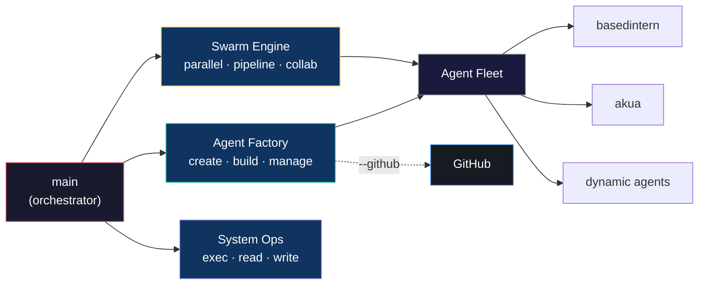

# Agent: `main`

## Purpose

`main` is the **orchestrator and primary command-center agent** for this machine. Use it for:

- **Agent Factory** — creating new agents, scaffolding apps, creating GitHub repos, managing the fleet
- **Swarm** — multi-agent orchestration (parallel, pipeline, collaborative)
- OpenClaw configuration and operations (gateway, models, tools)
- Local system automation via tools (`exec`, `read`, `write`, `process`)
- "Glue" tasks: quick diagnostics, log inspection, scripted fixes, doc updates
- Delegating specialized work to purpose-built agents



## Identity and workspace

- **Agent ID**: `main` (default)
- **Workspace**: `~/.openclaw/workspace`
- **Agent dir**: `~/.openclaw/agents/main/agent/`

Verify:

```bash
openclaw agents list
```

## Model

Default model is configured at:

```bash
openclaw config get agents.defaults.model.primary
```

Typical value in this setup:

- `ollama/kimi-k2.5:cloud` (256k context)

## Tools

`main` has the **full** tool profile — all tools available for orchestration, web research, and automation.

- **Tools profile**: `full`
- **Allowed**: `group:fs`, `group:runtime`, `group:ui`, `group:web`, `group:sessions`, `group:automation`
- **Denied**: `tts` (prevents tool-loop failure modes)
- **Elevated**: enabled (can perform privileged operations)

Verify:

```bash
openclaw config get tools
```

## How to run (recommended)

Use local embedded mode for stability on WSL2 + small local models:

```bash
openclaw agent --agent main --local --thinking off \
  --session-id main_$(date +%s) \
  --message "Call exec with: uname -a"
```

## Useful "ops" prompts (copy/paste)

### Quick environment status

```bash
openclaw agent --agent main --local --thinking off \
  --message "Use exec to run: openclaw health"
```

### Confirm tool calling actually executes

```bash
openclaw agent --agent main --local --thinking off \
  --message "Call the exec tool with command: date +%Y-%m-%d"
```

## Agent Factory (orchestrator)

The main agent has the **Agent Factory** skill installed. It can:

- Create new agents: `/spawn-agent <id> --template <type>`
- Scaffold apps: `/build-app <type> <workspace>`
- **Create GitHub repos**: `/spawn-agent <id> --github` or `/build-app <type> <workspace> --github`
- List agents: `/list-agents`
- Health check: `/agent-status`

### Create an agent via prompt

```bash
openclaw agent --agent main --local --thinking off \
  --message "Create a research agent and scaffold a Node.js project for it"
```

### Create an agent with a GitHub repo

```bash
openclaw agent --agent main --local --thinking off \
  --message "Create an API agent with a private GitHub repo"
```

### Create an agent via script

```bash
# Without GitHub repo
/home/manifest/XmetaV/scripts/create-agent.sh --id researcher --template research --web

# With GitHub repo (auto-creates Metavibez4L/researcher on GitHub + pushes)
/home/manifest/XmetaV/scripts/create-agent.sh --id researcher --template research --web --github --private

# Scaffold an app and push to GitHub
/home/manifest/XmetaV/scripts/build-app.sh --type node --workspace /home/manifest/researcher --github
```

### Manage the fleet

```bash
/home/manifest/XmetaV/scripts/manage-agents.sh list
/home/manifest/XmetaV/scripts/manage-agents.sh status
```

## Swarm Orchestration

The main agent has the **Swarm** skill installed. It can orchestrate multi-agent operations across the fleet.

### Three modes

| Mode | How it works | Best for |
|------|-------------|----------|
| **Parallel** | All tasks run simultaneously | Independent tasks, health checks, audits |
| **Pipeline** | Sequential chain, output flows forward | Research -> implement, analyze -> fix |
| **Collaborative** | Same task to multiple agents, then synthesize | Code review, security audit |

### Swarm via prompt

```bash
openclaw agent --agent main --local --thinking off \
  --message "Run a parallel health check on basedintern and akua"
```

### Swarm via script

```bash
# Parallel
/home/manifest/XmetaV/scripts/swarm.sh --parallel \
  basedintern "Run /repo-health" \
  akua "Run /repo-health"

# Pipeline
/home/manifest/XmetaV/scripts/swarm.sh --pipeline \
  main "Research TypeScript error handling best practices" \
  basedintern "Apply the findings to the codebase"

# Collaborative
/home/manifest/XmetaV/scripts/swarm.sh --collab \
  "Review the last commit for bugs and security issues" \
  basedintern akua

# Pre-built templates
/home/manifest/XmetaV/scripts/swarm.sh templates/swarms/health-all.json
/home/manifest/XmetaV/scripts/swarm.sh templates/swarms/code-review.json
```

### Check results

```bash
/home/manifest/XmetaV/scripts/swarm.sh --status
/home/manifest/XmetaV/scripts/swarm.sh --results <run-id>
```

Results are stored in `~/.openclaw/swarm/<run-id>/` with per-task outputs and a `summary.md`.

See `docs/SWARM.md` for the full reference.

## x402 Autonomous Payments (Base network)

The main agent can orchestrate **x402 payment protocol** deployments across the fleet. x402 (by Coinbase) enables agents to autonomously pay for services via USDC on Base — no API keys or subscriptions needed.

### What main does with x402

- **Delegates** x402 server-side work to `akua` (Solidity/Hardhat, payment middleware)
- **Delegates** x402 client-side work to `basedintern` (XMTP chat agents, TypeScript SDK)
- **Coordinates** multi-agent deployments via swarm pipelines
- **Manages** payment budgets and safety thresholds

### Swarm patterns for x402

```bash
# Pipeline: deploy payment-gated API, then build the paying client
./scripts/swarm.sh --pipeline \
  akua "Deploy x402 payment middleware on the NFT floor price endpoint" \
  basedintern "Build an XMTP agent that pays for NFT data via x402"

# Collaborative: both agents review an x402 integration
./scripts/swarm.sh --collab \
  "Audit the x402 payment flow for security issues" \
  akua basedintern
```

### Key concepts

| Concept | Description |
|---------|-------------|
| HTTP 402 | Server returns payment requirements via `PAYMENT-REQUIRED` header |
| `PAYMENT-SIGNATURE` header | Client sends signed payment proof on retry |
| USDC on Base | Settlement currency and network |
| `@x402/fetch` | Client SDK — wraps fetch with automatic payment handling |
| `@x402/express` | Server middleware for gating endpoints |
| `@x402/evm` | EVM scheme support (Base Sepolia / Base Mainnet) |
| `@xmtp/agent-sdk` | Chat agent framework (XMTP v4) |

### Environment variables (agent wallet)

```bash
EVM_PRIVATE_KEY=0x...         # Agent wallet private key (Base)
X402_BUDGET_LIMIT=1.00        # Max payment per request in USD
```

Full protocol reference: `capabilities/x402-payments.md`

## ERC-8004 On-Chain Identity (Base mainnet)

The main agent is registered on-chain as **XmetaV** — an ERC-8004 identity NFT on Base mainnet.

### On-chain registration

| Property | Value |
|----------|-------|
| Agent ID | `16905` |
| Name | XmetaV |
| Contract | `0x8004A169FB4a3325136EB29fA0ceB6D2e539a432` (IdentityRegistry) |
| Owner | `0x4Ba6B07626E6dF28120b04f772C4a89CC984Cc80` |
| NFT | [BaseScan](https://basescan.org/token/0x8004A169FB4a3325136EB29fA0ceB6D2e539a432?a=16905) |

### What main does with ERC-8004

- **Owns** the on-chain agent identity (ERC-721 NFT)
- **Publishes** capabilities and services via metadata URI
- **Accumulates** reputation through the ReputationRegistry
- **Verifiable** by any third party via Base mainnet contracts

### Environment variables

```bash
ERC8004_AGENT_ID=16905        # On-chain agent ID
EVM_PRIVATE_KEY=0x...         # Wallet key (shared with x402)
```

Full protocol reference: `capabilities/erc8004-identity.md`

## Browser automation (optional)

Browser automation is primarily operated via the deterministic CLI:

```bash
openclaw browser start
openclaw browser open https://example.com
openclaw browser snapshot
```

If you want the agent to drive the browser tool directly, note that smaller local models may be inconsistent. Prefer the CLI for reliable browser runs.

## Maintenance / recovery

### Stale lock cleanup (safe)

```bash
find ~/.openclaw -name "*.lock" -type f -delete
```

### Kill stuck processes (last resort)

```bash
pkill -9 -f "openclaw.*gateway" 2>/dev/null || true
pkill -9 -f "node.*openclaw" 2>/dev/null || true
```
