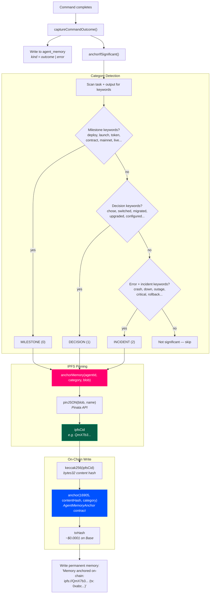
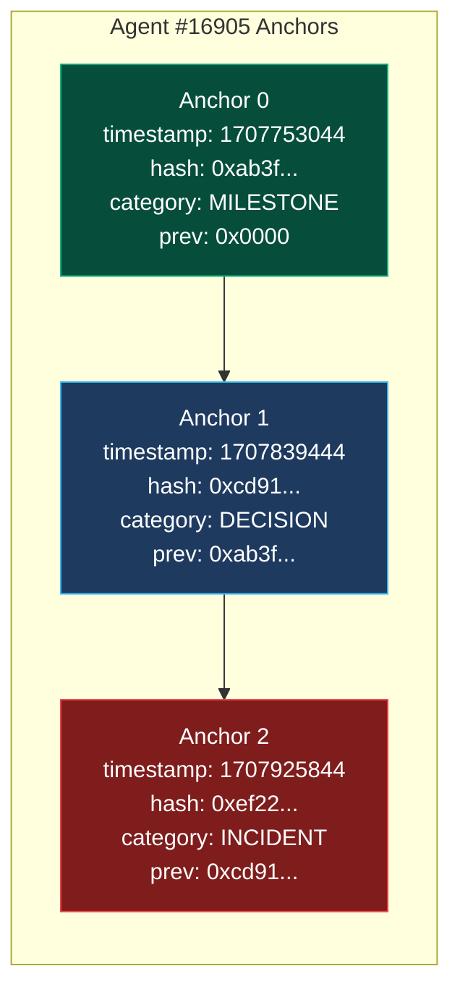
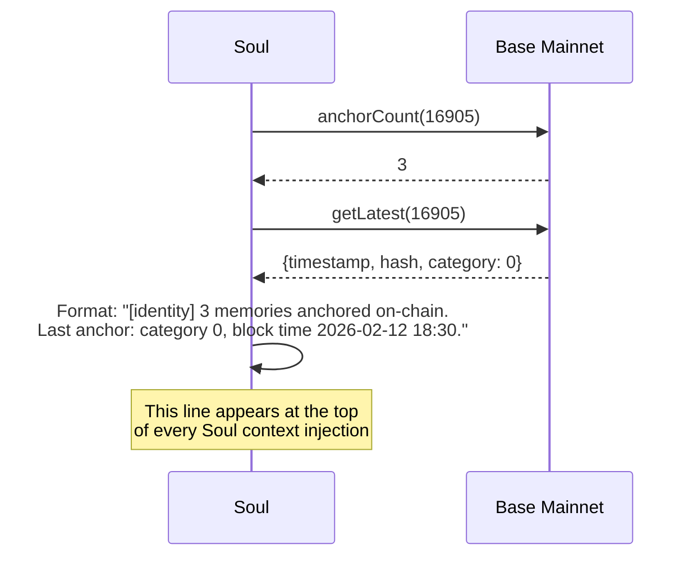

# On-Chain Memory Anchoring

> When something significant happens — a deployment, a critical decision, an incident — XmetaV doesn't just store it in the database. It pins the memory to IPFS and writes a permanent hash to Base Mainnet. These anchors create a tamper-proof, verifiable memory trail on-chain.

---

## How It Works



---

## The Anchor Contract

**AgentMemoryAnchor** on Base Mainnet stores a linked list of content hashes per agent:



### Contract ABI (used functions)

| Function | Type | Description |
|----------|------|-------------|
| `anchor(agentId, contentHash, category)` | write | Store a new memory anchor |
| `getLatest(agentId)` | view | Get the most recent anchor |
| `anchorCount(agentId)` | view | Total anchors for an agent |
| `getAnchors(agentId, from, count)` | view | Paginated anchor history |

### Memory Categories

| Category | Value | Keyword Triggers |
|----------|-------|-----------------|
| `MILESTONE` | 0 | deploy, launched, release, shipped, contract, token, created, mainnet, live |
| `DECISION` | 1 | chose, decided, switched, migrated, upgraded, replaced, configured |
| `INCIDENT` | 2 | crash, down, outage, failed, timeout, panic, critical, rollback |

Incidents require both `kind = "error"` AND incident keywords to trigger.

---

## IPFS Storage

Each anchored memory is pinned as a JSON blob to Pinata IPFS:

```json
{
  "agentId": 16905,
  "category": 0,
  "content": "Compiled 3 contracts. Deployed StakingVault to 0x7a2b...",
  "kind": "outcome",
  "source": "web3dev",
  "task": "deploy the staking contract on Base mainnet",
  "timestamp": "2026-02-14T05:30:00.000Z",
  "anchoredAt": "2026-02-14T05:30:12.000Z"
}
```

Accessible at: `https://gateway.pinata.cloud/ipfs/<CID>`

### Cost

| Component | Cost |
|-----------|------|
| IPFS pin (Pinata free tier) | Free (1 GB storage) |
| On-chain anchor (Base L2) | ~$0.0001 per write |
| Memory blob size | ~1-2 KB each |

---

## How Soul Uses Anchors

During context retrieval, Soul reads the on-chain anchor count to inject identity context:



This gives agents a persistent sense of their on-chain history — how many significant events have been permanently recorded, and when the last one was.

---

## Configuration

Anchoring requires three environment variables in `bridge/.env`:

| Variable | Required | Description |
|----------|----------|-------------|
| `ANCHOR_CONTRACT_ADDRESS` | Yes | AgentMemoryAnchor contract on Base |
| `EVM_PRIVATE_KEY` | Yes | Wallet private key for signing txs |
| `PINATA_JWT` | Yes | Pinata API JWT for IPFS pinning |
| `BASE_RPC_URL` | No | Custom RPC (default: `https://mainnet.base.org`) |
| `ERC8004_AGENT_ID` | No | Agent ID (default: `16905`) |

If any required variable is missing, anchoring silently skips — it's never fatal to command execution.

---

## Source Files

| File | Purpose |
|------|---------|
| `bridge/lib/memory-anchor.ts` | `anchorMemory()`, `getLatestAnchor()`, `isAnchoringEnabled()` |
| `bridge/lib/ipfs-pinata.ts` | `pinJSON()`, `isPinataConfigured()`, `ipfsGatewayURL()` |
| `bridge/lib/agent-memory.ts` | `anchorIfSignificant()` — keyword detection and trigger |

---

## Next

- [Architecture Overview](./README.md) — Full system diagram and data flow
- [Soul Agent Deep Dive](./SOUL.md) — Context curation, associations, and dream consolidation
