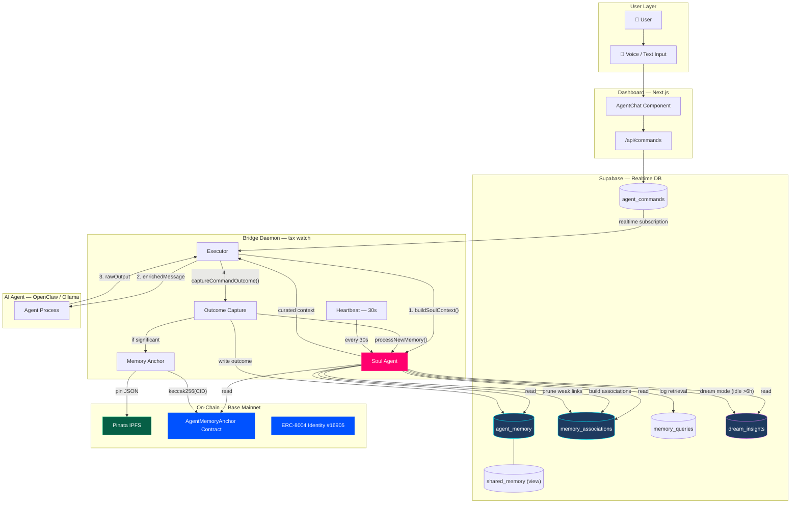
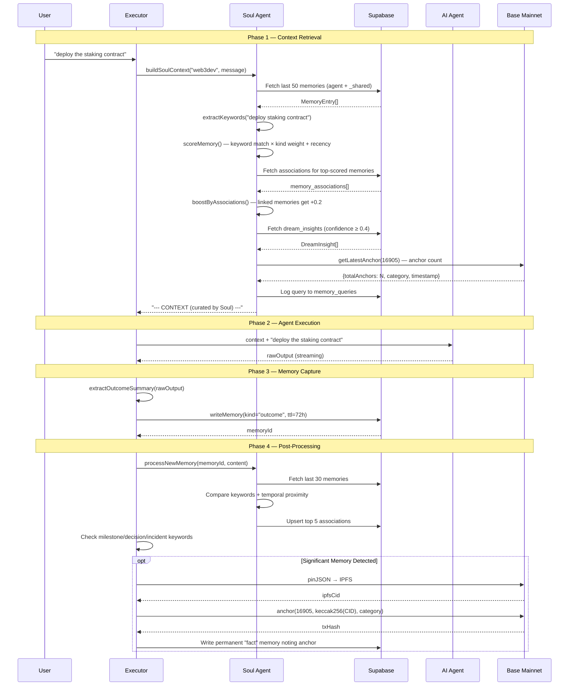
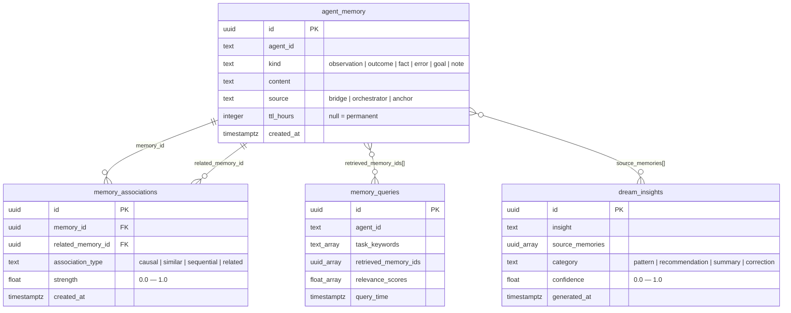
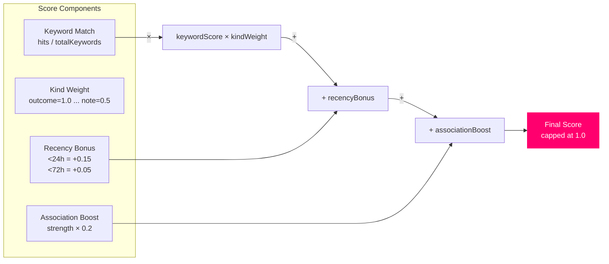

# Memory System — Architecture

> XmetaV's persistent memory system gives agents the ability to learn from past interactions, build connections between memories, and consolidate knowledge during idle periods. This is the cognitive layer that makes the fleet intelligent across sessions.

---

## System Overview



---

## The Memory Lifecycle

Every command that flows through XmetaV follows a four-phase memory lifecycle:



---

## Database Schema

Four tables and one view power the memory system:



### Shared Memory

Any memory with `agent_id = '_shared'` is visible to **all** agents. The `shared_memory` view exposes these:

```sql
SELECT * FROM agent_memory
WHERE agent_id = '_shared'
ORDER BY created_at DESC;
```

---

## Memory Kinds

| Kind | Weight | TTL | Description |
|------|--------|-----|-------------|
| `outcome` | 1.0 | 72h | Result summary of a completed task |
| `fact` | 1.0 | permanent | Persistent knowledge (e.g., anchored memory references) |
| `error` | 0.9 | 72h | Failure worth remembering |
| `goal` | 0.8 | permanent | Ongoing objective |
| `observation` | 0.6 | 72h | Something noticed during execution |
| `note` | 0.5 | varies | Freeform note from orchestrator |

Higher-weight kinds are prioritized during relevance scoring. `outcome` and `fact` entries are always surfaced first.

---

## Relevance Scoring

Soul scores each memory with a composite formula:



**Example:** A memory containing 3/5 task keywords (`0.6`), of kind `outcome` (`×1.0`), created 12 hours ago (`+0.15`), associated with another top memory (`+0.12`):

$$\text{score} = \min(1.0,\ 0.6 \times 1.0 + 0.15 + 0.12) = 0.87$$

---

## File Map

```
dashboard/bridge/
├── lib/
│   ├── agent-memory.ts        # Core read/write/capture layer
│   ├── memory-anchor.ts       # IPFS pinning + on-chain anchor
│   ├── ipfs-pinata.ts         # Pinata IPFS client
│   └── soul/
│       ├── index.ts           # Public exports
│       ├── types.ts           # TypeScript interfaces + defaults
│       ├── context.ts         # Context orchestrator (main brain)
│       ├── retrieval.ts       # Keyword scoring + association boost
│       ├── associations.ts    # Post-task association builder
│       ├── dream.ts           # Idle consolidation + insight generation
│       ├── check-tables.ts    # Table existence checker
│       └── migrate.ts         # Migration helper
└── src/
    ├── executor.ts            # Injects Soul context before dispatch
    └── heartbeat.ts           # Triggers dream mode every 30s
```

---

## Next

- [Soul Agent Deep Dive](./SOUL.md) — How Soul curates context, builds associations, and dreams
- [On-Chain Anchoring](./ANCHORING.md) — IPFS + Base Mainnet memory permanence
