# Memory System — Architecture

> XmetaV's persistent memory system gives agents the ability to learn from past interactions, build connections between memories, and consolidate knowledge during idle periods. This is the cognitive layer that makes the fleet intelligent across sessions.

---

## System Overview


---

## The Memory Lifecycle

Every command that flows through XmetaV follows a four-phase memory lifecycle:


---

## Database Schema

Four tables and one view power the memory system:

```mermaid
erDiagram
    agent_memory {
        uuid id PK
        text agent_id
        text kind "observation | outcome | fact | error | goal | note"
        text content
        text source "bridge | orchestrator | anchor"
        integer ttl_hours "null = permanent"
        timestamptz created_at
    }

    memory_associations {
        uuid id PK
        uuid memory_id FK
        uuid related_memory_id FK
        text association_type "causal | similar | sequential | related"
        float strength "0.0 — 1.0"
        timestamptz created_at
    }

    memory_queries {
        uuid id PK
        text agent_id
        text_array task_keywords
        uuid_array retrieved_memory_ids
        float_array relevance_scores
        timestamptz query_time
    }

    dream_insights {
        uuid id PK
        text insight
        uuid_array source_memories
        text category "pattern | recommendation | summary | correction"
        float confidence "0.0 — 1.0"
        timestamptz generated_at
    }

    agent_memory ||--o{ memory_associations : "memory_id"
    agent_memory ||--o{ memory_associations : "related_memory_id"
    agent_memory }o--o{ memory_queries : "retrieved_memory_ids[]"
    agent_memory }o--o{ dream_insights : "source_memories[]"
```



### Shared Memory

Any memory with `agent_id = '_shared'` is visible to **all** agents. The `shared_memory` view exposes these:

```sql
SELECT * FROM agent_memory
WHERE agent_id = '_shared'
ORDER BY created_at DESC;
```

---

## Memory Kinds

| Kind | Weight | TTL | Description |
|------|--------|-----|-------------|
| `outcome` | 1.0 | 72h | Result summary of a completed task |
| `fact` | 1.0 | permanent | Persistent knowledge (e.g., anchored memory references) |
| `error` | 0.9 | 72h | Failure worth remembering |
| `goal` | 0.8 | permanent | Ongoing objective |
| `observation` | 0.6 | 72h | Something noticed during execution |
| `note` | 0.5 | varies | Freeform note from orchestrator |

Higher-weight kinds are prioritized during relevance scoring. `outcome` and `fact` entries are always surfaced first.

---

## Relevance Scoring

Soul scores each memory with a composite formula:

```mermaid
graph LR
    subgraph "Score Components"
        KW["Keyword Match<br/>hits / totalKeywords"]
        KIND["Kind Weight<br/>outcome=1.0 ... note=0.5"]
        RECENCY["Recency Bonus<br/>&lt;24h = +0.15<br/>&lt;72h = +0.05"]
        ASSOC["Association Boost<br/>strength × 0.2"]
    end

    KW -->|"×"| MULT["keywordScore × kindWeight"]
    MULT -->|"+"| ADD["+ recencyBonus"]
    RECENCY --> ADD
    ADD -->|"+"| FINAL["+ associationBoost"]
    ASSOC --> FINAL
    FINAL --> SCORE["Final Score<br/>capped at 1.0"]

    style SCORE fill:#ff006e,stroke:#ff006e,color:#fff
```



**Example:** A memory containing 3/5 task keywords (`0.6`), of kind `outcome` (`×1.0`), created 12 hours ago (`+0.15`), associated with another top memory (`+0.12`):

$$\text{score} = \min(1.0,\ 0.6 \times 1.0 + 0.15 + 0.12) = 0.87$$

---

## File Map

```
dashboard/bridge/
├── lib/
│   ├── agent-memory.ts        # Core read/write/capture layer
│   ├── memory-anchor.ts       # IPFS pinning + on-chain anchor
│   ├── ipfs-pinata.ts         # Pinata IPFS client
│   └── soul/
│       ├── index.ts           # Public exports
│       ├── types.ts           # TypeScript interfaces + defaults
│       ├── context.ts         # Context orchestrator (main brain)
│       ├── retrieval.ts       # Keyword scoring + association boost
│       ├── associations.ts    # Post-task association builder
│       ├── dream.ts           # Idle consolidation + insight generation
│       ├── check-tables.ts    # Table existence checker
│       └── migrate.ts         # Migration helper
└── src/
    ├── executor.ts            # Injects Soul context before dispatch
    └── heartbeat.ts           # Triggers dream mode every 30s
```

---

## Next

- [Soul Agent Deep Dive](./SOUL.md) — How Soul curates context, builds associations, and dreams
- [On-Chain Anchoring](./ANCHORING.md) — IPFS + Base Mainnet memory permanence
