# Soul Agent — Memory Orchestrator

> Soul is the cognitive layer of XmetaV. It sits between raw memory storage and agent execution, curating what each agent remembers, building connections between memories, and consolidating knowledge while the fleet sleeps.

**Codename:** Soul
**Color:** Magenta (`#ff006e`)
**Arena:** Private alcove behind glass (SOUL office)
**Meeting Seat:** 195° (observer position)

---

## How Soul Thinks

Soul operates in three modes, each triggered at a different point in the command lifecycle:

```mermaid
stateDiagram-v2
    [*] --> Retrieval: Command arrives

    state "🔍 Retrieval Mode" as Retrieval {
        [*] --> ExtractKeywords
        ExtractKeywords --> FetchMemories: keywords[]
        FetchMemories --> ScoreMemories: last 50 entries
        ScoreMemories --> BoostByAssoc: scored[]
        BoostByAssoc --> FetchInsights: boosted[]
        FetchInsights --> AssembleContext: insights[]
        AssembleContext --> [*]: context string
    }

    Retrieval --> Execution: enrichedMessage → agent

    state "🔗 Association Mode" as Association {
        [*] --> ExtractNewKW: new memory written
        ExtractNewKW --> CompareRecent: vs last 30 memories
        CompareRecent --> CalcStrength: keyword overlap + temporal
        CalcStrength --> StoreTop5: upsert associations
        StoreTop5 --> [*]
    }

    Execution --> Association: captureCommandOutcome()

    state "💤 Dream Mode" as Dream {
        [*] --> CheckIdle: heartbeat (30s)
        CheckIdle --> FetchAll48h: fleet idle > 6h
        FetchAll48h --> Cluster: keyword clustering
        Cluster --> GenInsights: pattern detection
        GenInsights --> PruneWeak: remove strength < 0.15
        PruneWeak --> [*]
    }

    Association --> [*]
    Dream --> [*]

    note right of Dream
        Triggered by heartbeat
        Only when fleet is idle
        Opportunistic, not scheduled
    end note
```



---

## Retrieval Mode — Building Context

When a command arrives, Soul assembles the most relevant context for the agent. This replaces the old "last 15 entries" approach with intelligent curation.


### Context String Format

What the agent actually sees prepended to its task:

```
--- CONTEXT (curated by Soul) ---
[identity] 3 memories anchored on-chain. Last anchor: category 0, block time 2026-02-12 18:30.
[insight] Strong track record with [deploy, contract, base]: 4/5 successful outcomes across 2 agent(s).
[outcome] 2026-02-14 05:30: Task: "compile staking contract" → completed. Output: Compiled 3 contracts...
[fact] 2026-02-13 18:00: USDC balance is 42.5 ★
[shared] 2026-02-13 12:00: $XMETAV token deployed at 0x5b56...
--- END CONTEXT ---

deploy the staking contract on Base mainnet
```

The `★` marker indicates high-relevance memories (score ≥ 0.5).

---

## Association Mode — Connecting Memories

After every command completes, Soul links the new memory to related ones. This builds a **memory graph** that strengthens retrieval over time.

```mermaid
flowchart TD
    NEW["New memory written<br/>processNewMemory(id, agentId, content)"]

    NEW --> EK["extractKeywords(content)<br/><i>e.g. ['deploy', 'staking', 'contract', 'base']</i>"]

    EK --> FETCH["Fetch last 30 memories<br/>for same agent + _shared"]

    FETCH --> LOOP["For each existing memory:"]

    LOOP --> CMP["Compare keyword sets"]

    subgraph "Strength Calculation"
        CMP --> OVERLAP["overlap = shared keywords<br/>keywordStrength = overlap / max(kw1, kw2)"]
        OVERLAP --> TEMPORAL["Temporal bonus:<br/>&lt;1h → +0.2<br/>&lt;6h → +0.1<br/>older → +0.0"]
        TEMPORAL --> STRENGTH["strength = keywordStrength + temporalBonus<br/><i>capped at 1.0, skip if &lt; 0.15</i>"]
    end

    STRENGTH --> TYPE["Determine type:<br/>&lt;1h apart → sequential<br/>keywordStrength > 0.5 → similar<br/>default → related"]

    TYPE --> TOP5["Sort by strength DESC<br/>Keep top 5 associations"]

    TOP5 --> UPSERT["Upsert to memory_associations<br/><i>on conflict: update strength</i>"]

    style NEW fill:#ff006e,stroke:#ff006e,color:#fff
    style UPSERT fill:#1e3a5f,stroke:#00f0ff,color:#fff
```



### Association Types

| Type | When | Example |
|------|------|---------|
| `sequential` | Memories within 1 hour of each other | "compile contract" → "deploy contract" |
| `similar` | Keyword overlap > 50% | Two different audit results |
| `causal` | Reserved for future LLM inference | Error → fix that resolved it |
| `related` | Default — weak but non-zero link | Same topic, different time |

### Reinforcement

When a retrieval proves useful (the agent performs well), associations between retrieved memories get **reinforced** — their strength increases by `+0.1`, making them more likely to surface together next time:


---

## Dream Mode — Idle Consolidation

When the fleet has been idle for more than 6 hours, Soul enters **dream mode** — an autonomous consolidation process triggered by the bridge heartbeat.

```mermaid
flowchart TD
    HB["Heartbeat (every 30s)"] --> CHECK["maybeStartDream()"]

    CHECK --> Q1{isDreaming?}
    Q1 -->|yes| SKIP[Skip]
    Q1 -->|no| Q2{Last dream<br/>> 6h ago?}
    Q2 -->|no| SKIP
    Q2 -->|yes| Q3{Any busy<br/>agents?}
    Q3 -->|yes| SKIP
    Q3 -->|no| Q4{Any commands<br/>in last 6h?}
    Q4 -->|yes| SKIP
    Q4 -->|no| DREAM["🌙 Enter Dream Mode"]

    DREAM --> FETCH["Fetch all memories<br/>from last 48 hours"]

    FETCH --> Q5{≥ 3 memories?}
    Q5 -->|no| WAKE["Wake up — not enough to dream about"]
    Q5 -->|yes| CLUSTER["Cluster by keyword overlap<br/><i>≥ 2 shared keywords OR<br/>> 40% similarity</i>"]

    CLUSTER --> GEN["Generate insights<br/>from each cluster"]

    subgraph "Insight Generation"
        GEN --> ERR{errors > outcomes<br/>AND errors ≥ 2?}
        ERR -->|yes| CORRECTION["🔴 Correction<br/>'Recurring issues around [X]: N/M are errors'"]
        ERR -->|no| SUC{outcomes ≥ 3?}
        SUC -->|yes| PATTERN["🟢 Pattern<br/>'Strong track record with [X]: N/M successful'"]
        SUC -->|no| ACT{total ≥ 4?}
        ACT -->|yes| SUMMARY["🔵 Summary<br/>'High activity around [X]: N memories in 48h'"]
        ACT -->|no| NONE["Skip — not significant"]
    end

    CORRECTION --> SAVE
    PATTERN --> SAVE
    SUMMARY --> SAVE

    SAVE["Save to dream_insights<br/><i>with confidence score</i>"]

    SAVE --> PRUNE["Prune weak associations<br/><i>delete strength &lt; 0.15</i>"]

    PRUNE --> DONE["Dream complete ✓<br/>Update lastDreamTime"]

    style DREAM fill:#ff006e,stroke:#ff006e,color:#fff
    style CORRECTION fill:#7f1d1d,stroke:#ef4444,color:#fff
    style PATTERN fill:#064e3b,stroke:#10b981,color:#fff
    style SUMMARY fill:#1e3a5f,stroke:#38bdf8,color:#fff
```



### Dream Insight Categories

| Category | Confidence | Trigger | Example |
|----------|-----------|---------|---------|
| `correction` | 0.4 + errors×0.1 | More errors than outcomes, ≥2 errors | "Recurring issues around [deploy, base]: 3/4 memories are errors" |
| `pattern` | 0.4 + outcomes×0.1 | ≥3 successful outcomes | "Strong track record with [audit, contract]: 4/5 successful" |
| `summary` | 0.5 | ≥4 related memories | "High activity around [swap, USDC]: 6 memories in 48h" |
| `recommendation` | reserved | Future: LLM-generated advice | "Consider running tests before deploy — last 2 deploys failed" |

---

## Main Agent Integration

Main (the fleet commander) doesn't call Soul directly — Soul is invisible infrastructure. Here's how they interact:

```mermaid
flowchart LR
    subgraph "Main Agent"
        M_IN["Receives task<br/>with Soul context<br/>prepended"]
        M_EXEC["Executes task<br/>using context"]
        M_OUT["Returns output"]
    end

    subgraph "Bridge — Executor"
        E_CMD["Command arrives"]
        E_SOUL["buildSoulContext()"]
        E_SPAWN["Spawn agent"]
        E_CAPTURE["captureCommandOutcome()"]
    end

    subgraph "Soul Agent"
        S_RETRIEVE["Retrieval Mode<br/>Score & rank memories"]
        S_ASSOC["Association Mode<br/>Link new memory"]
        S_DREAM["Dream Mode<br/>Consolidate patterns"]
    end

    subgraph "Supabase"
        DB_MEM[("agent_memory")]
        DB_ASSOC[("memory_associations")]
        DB_DREAM[("dream_insights")]
    end

    E_CMD -->|"1"| E_SOUL
    E_SOUL -->|"2"| S_RETRIEVE
    S_RETRIEVE --> DB_MEM
    S_RETRIEVE --> DB_ASSOC
    S_RETRIEVE --> DB_DREAM
    S_RETRIEVE -->|"3 context"| E_SOUL
    E_SOUL -->|"4 enriched msg"| E_SPAWN
    E_SPAWN -->|"5"| M_IN
    M_IN --> M_EXEC --> M_OUT
    M_OUT -->|"6 rawOutput"| E_CAPTURE
    E_CAPTURE -->|"7 write"| DB_MEM
    E_CAPTURE -->|"8"| S_ASSOC
    S_ASSOC -->|"9 link"| DB_ASSOC

    style S_RETRIEVE fill:#ff006e,stroke:#ff006e,color:#fff
    style S_ASSOC fill:#ff006e,stroke:#ff006e,color:#fff
    style S_DREAM fill:#ff006e,stroke:#ff006e,color:#fff
```



### What Main Sees vs What Happens

| What Main Sees | What Actually Happens |
|---------------|----------------------|
| `--- CONTEXT (curated by Soul) ---` block at the top of its message | Soul scored 50 memories, boosted via associations, fetched dream insights, checked on-chain anchors |
| Nothing after completing a task | Bridge captured output → wrote memory → Soul built up to 5 associations → checked for on-chain anchoring |
| Better context over time | Dream mode ran overnight, consolidated 48h of memories into insights, pruned weak associations |

Main never needs to think about memory management. It simply receives richer, more relevant context with every task.

---

## Configuration

Soul's behavior is tuned by `DEFAULT_CONFIG` in `types.ts`:

| Parameter | Default | Description |
|-----------|---------|-------------|
| `maxRetrievalCount` | 10 | Maximum memories returned per context query |
| `maxContextChars` | 3000 | Maximum characters in injected context |
| `dreamIdleThresholdHours` | 6 | Hours of idle time before dream mode triggers |
| `minAssociationStrength` | 0.3 | Minimum strength to include in context boosts |
| `associationScanWindow` | 50 | How many recent memories to scan for retrieval |

---

## Source Files

| File | Purpose |
|------|---------|
| `bridge/lib/soul/index.ts` | Public exports — entry point |
| `bridge/lib/soul/types.ts` | TypeScript interfaces, `DEFAULT_CONFIG` |
| `bridge/lib/soul/context.ts` | Context orchestrator — `buildSoulContext()`, `processNewMemory()` |
| `bridge/lib/soul/retrieval.ts` | `extractKeywords()`, `scoreMemory()`, `retrieveRelevantMemories()` |
| `bridge/lib/soul/associations.ts` | `buildAssociations()`, `reinforceAssociation()` |
| `bridge/lib/soul/dream.ts` | `maybeStartDream()`, `runDreamCycle()`, `getRelevantInsights()` |

---

## Next

- [Architecture Overview](./README.md) — Full system diagram and data flow
- [On-Chain Anchoring](./ANCHORING.md) — How significant memories get pinned to IPFS and anchored on Base
